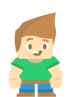
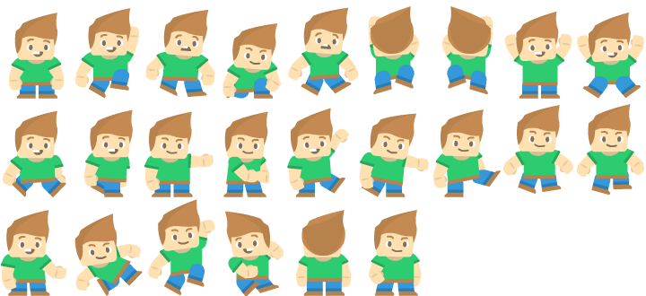
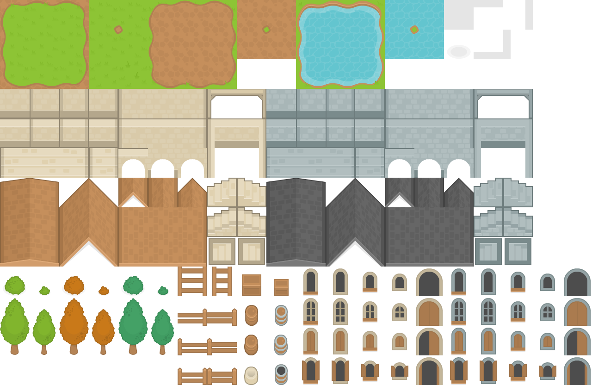
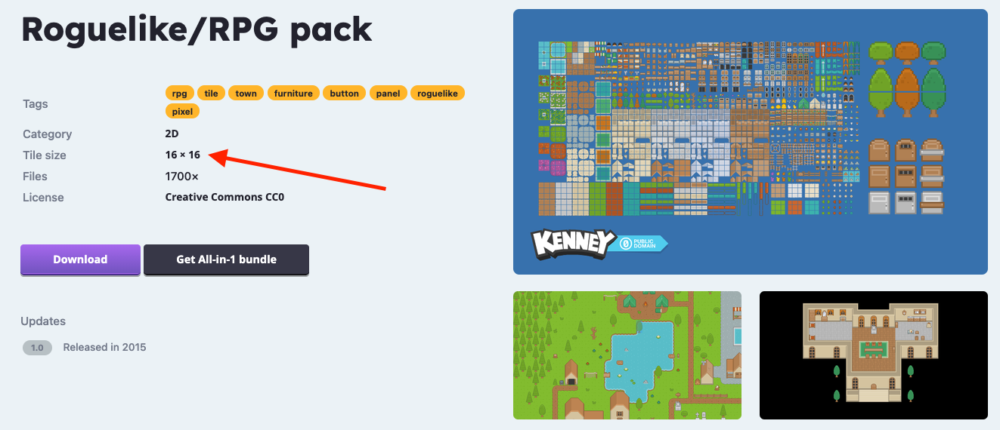
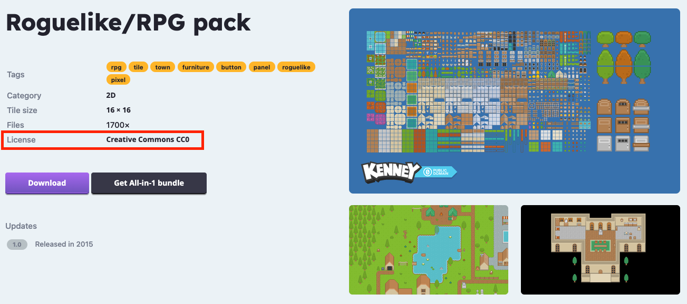

# Sådan finder du grafik til dit spil

*Find grafik, der passer til dit spil og kan bruges i Godot.*

## 🎯 Målet med guiden

Når du er færdig, har du fundet grafik til dit spil, som:

- passer nogenlunde sammen i stil
- har en størrelse, du kan arbejde med
- må bruges i dit projekt
- kan importeres i Godot

Du behøver **ikke** finde al grafik til hele spillet på én gang. Start med det, du skal bruge først.

---

## 🧩 Hvilken grafik har du brug for?

Til et simpelt 2D-spil har du typisk brug for:

- en **spillerfigur**
- grafik til **banen**
- eventuelt ting, spilleren kan samle op
- eventuelt fjender eller andre figurer
- eventuelt grafik til knapper og brugerflade

Start med **spillerfiguren og banen**.

---

## 🎨 Sprite, spritesheet eller tilesheet?

Når du leder efter grafik, vil du ofte møde disse tre typer:

### Sprite

En **sprite** er et enkelt billede.
Det kan for eksempel være:

- én spillerfigur
- en nøgle
- en mønt
- en dør

En sprite er den nemmeste type grafik at starte med.


> *En sprite er ét enkelt billede.*

---

### Spritesheet

Et **spritesheet** indeholder flere billeder af den samme figur samlet i ét billede.

De forskellige billeder kan for eksempel bruges til:

- animation
- forskellige retninger
- forskellige handlinger

Et spritesheet kan for eksempel indeholde billeder af en figur, der går op, ned, til højre og til venstre.


> *Et spritesheet samler flere billeder af en figur i én fil.*

---

### Tilesheet

Et **tilesheet** indeholder mange små byggeklodser til en bane.

De enkelte felter kaldes **tiles**.

Et tilesheet kan for eksempel indeholde:

- græs
- gulv
- vægge
- vand
- stier
- træer
- klipper
- pynt

Godot kan dele tilesheetet op, så du kan bruge de enkelte tiles til at bygge din bane.


> *Et tilesheet består af mange små tiles, der kan bruges til at bygge en bane.*

---

## 🔎 Søg efter grafik, der passer til dit spil

Når du søger efter assets, kan du bruge ord, der beskriver både **spiltypen** og **grafikken**.

Eksempler:

```text
2D game assets
top down game assets
top down tileset
pixel art character
2D character spritesheet
fantasy tileset
space tileset
dungeon tileset
```

Hvis du allerede har valgt et tema til dit spil, kan du bruge det i søgningen.

Eksempel:

```text
top down forest tileset
```

eller:

```text
space character spritesheet
```

---

## 📐 Tjek størrelsen på dine tiles

Hvis du vælger et tilesheet, skal du vide, hvor store de enkelte tiles er.

Almindelige størrelser kan for eksempel være:

- `16 × 16` pixels
- `32 × 32` pixels
- `64 × 64` pixels

Se efter information om **Tile Size** eller størrelsen på de enkelte tiles.

### Et godt tilesheet har:

- et regelmæssigt grid
- samme størrelse på de enkelte tiles
- en oplyst tile-størrelse

### Undgå helst et tilesheet, hvis:

- du ikke kan finde tile-størrelsen
- felterne har meget forskellige størrelser
- billedet mest består af store færdige illustrationer
- du ikke tydeligt kan se, hvordan billedet skal deles op


> *Find tile-størrelsen, før du vælger et tilesheet.*

---

## 📜 Tjek om du må bruge grafikken

Assets har normalt en **licens**.

Licensen fortæller, hvad du må gøre med grafikken.

Se efter oplysninger om:

- om grafikken må bruges gratis
- om den må bruges i skoleprojekter
- om du skal skrive navnet på den person, der har lavet grafikken
- om grafikken må ændres

Gem linket eller licensfilen sammen med dine assets.

> **⚠️ Vigtigt:**  
> Brug ikke bare billeder fra en almindelig billedsøgning. Find grafik, hvor det tydeligt står, hvordan den må bruges.


> *Tjek altid licensen, før du bruger et asset. Hvis du er i tvivl, så spørg en lærer.*

---

## 🎨 Prøv at holde samme stil

Dit spil ser mere sammenhængende ud, hvis grafikken passer nogenlunde sammen.

Prøv for eksempel at undgå at blande:

- meget detaljeret grafik med meget simpel pixel art
- meget små figurer med meget store tiles
- top-down-grafik med grafik set direkte fra siden

Det behøver ikke være perfekt.

Det vigtigste er, at spilleren tydeligt kan se:

- hvad der er gulv
- hvad der er vægge
- hvor spillerfiguren er
- hvilke ting der er vigtige

---

## ✅ Assettjek

Inden du går videre, skal du kunne sætte kryds her:

- [ ] Jeg har grafik til min spillerfigur.
- [ ] Jeg har grafik til min bane.
- [ ] Hvis jeg bruger et tilesheet, kender jeg tile-størrelsen.
- [ ] Jeg ved, hvordan grafikken må bruges.
- [ ] Jeg har gemt linket eller licensinformationen.
- [ ] Min spillerfigur og min bane passer nogenlunde sammen i stil.

---

## 🎉 Færdig

Du har nu valgt de første assets til dit spil.

**Næste guide:** *Sådan får du dine assets ind i Godot.*