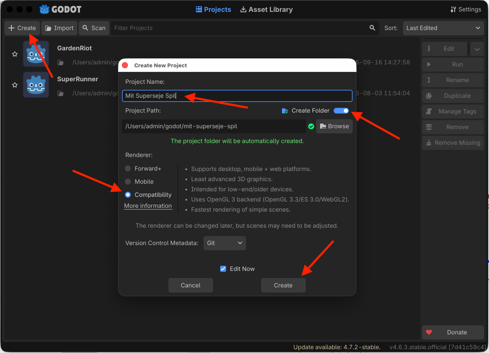
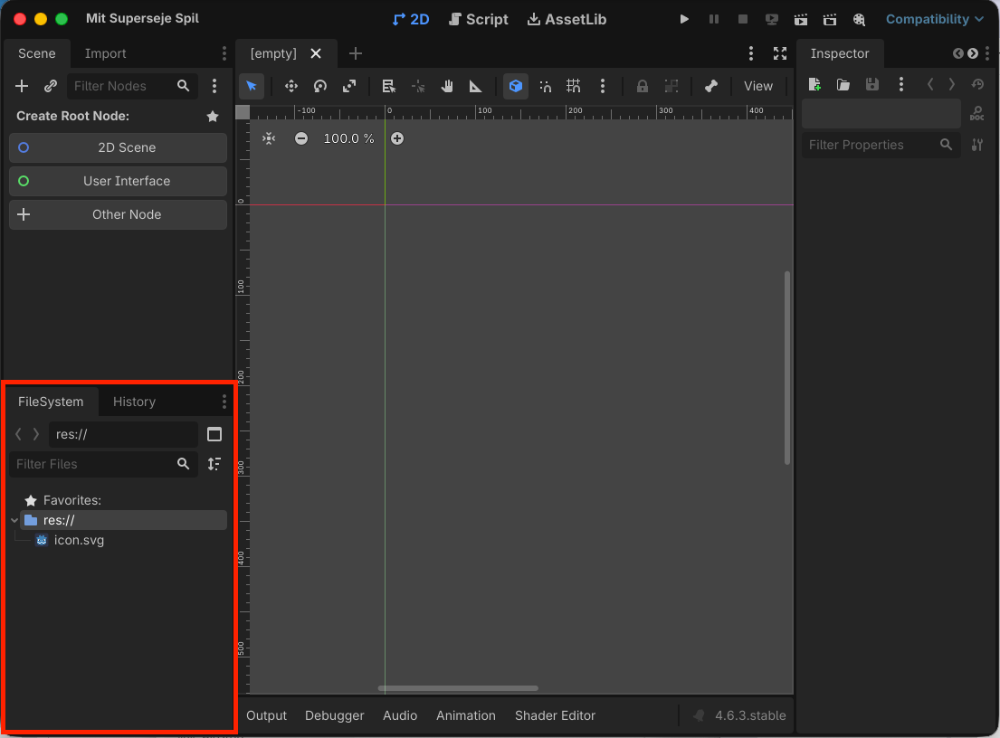
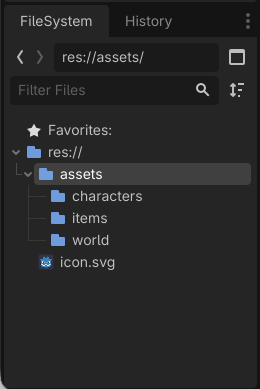
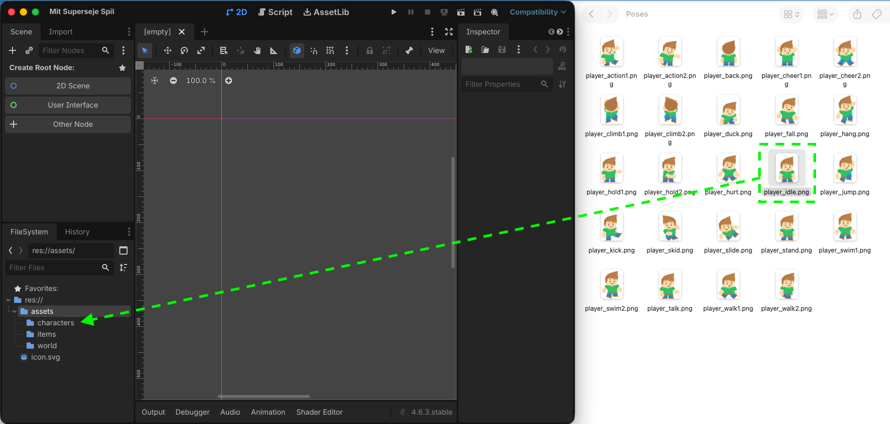
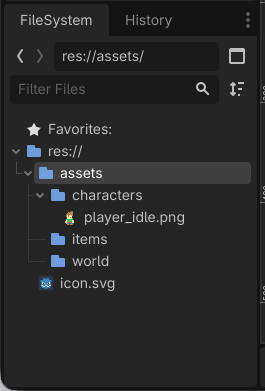

# Sådan får du dine assets ind i Godot

*Opret et Godot-projekt, organisér dine filer og få din grafik ind i projektet.*

## 🎯 Målet med guiden

Når du er færdig, har du:

- oprettet et nyt Godot-projekt
- lavet mapper til dine assets
- kopieret din grafik ind i projektet
- kontrolleret, at Godot kan se filerne

---

## 🚀 Trin 1: Opret et nyt projekt

Åbn **Godot**.

1. Klik **Create**.
2. Skriv navnet på dit spil.
3. Vælg en tom mappe til projektet.
4. Vælg **Compatibility** under *Renderer*.
5. Klik **Create & Edit**.

Godot åbner nu dit nye projekt.


> *Opret et nyt projekt og vælg Compatibility.*

---

## 📁 Trin 2: Find FileSystem

Nederst til venstre i Godot finder du panelet **FileSystem**.

Her kan du se alle de filer, der ligger i dit projekt.

Når Godot viser:

```text
res://
```

betyder det:

**roden af dit Godot-projekt**.

Alle filer, du vil bruge i spillet, skal ligge et sted under `res://`.


> *FileSystem viser filerne i dit Godot-projekt.*

---

## 📂 Trin 3: Lav en mappe til dine assets

Det bliver hurtigt svært at finde rundt, hvis alle billeder ligger direkte i `res://`.

Lav derfor først en mappe med navnet:

```text
assets
```

Du kan derefter lave undermapper.

Et eksempel kunne være:

```text
res://
└── assets/
    ├── characters/
    ├── world/
    ├── items/
    └── ui/
```

### Mapperne kan bruges sådan:

**`characters/`**  
Spillerfigurer, fjender og andre personer.

**`world/`**  
Tilesheets og anden grafik til banerne.

**`items/`**  
Mønter, nøgler, våben og andre ting i spillet.

**`ui/`**  
Knapper, ikoner og anden grafik til brugerfladen.

Du behøver kun oprette de mapper, du har brug for.

> **📌 Tip:**  
> Der findes ikke én rigtig mappestruktur. Det vigtigste er, at du selv kan finde dine filer igen.


> *Mapper gør det lettere at holde styr på spillets assets.*

---

## 📥 Trin 4: Kopiér grafikken ind i projektet

Find de billedfiler, du vil bruge, på din computer.

Træk dem ind i de rigtige mapper i **FileSystem**.

For eksempel:

```text
hero.png
```

kan placeres i:

```text
res://assets/characters/
```

Et tilesheet kan placeres i:

```text
res://assets/world/
```

Når filerne bliver lagt ind i projektet, importerer Godot dem automatisk.

Vent et øjeblik, hvis Godot stadig arbejder.


> *Træk dine billeder ind i Godot-projektets mapper.*

---

## 🔍 Trin 5: Kontroller dine filer

Klik på en af dine importerede billedfiler i **FileSystem**.

Du skal kunne:

- se filens navn
- finde den i den rigtige mappe
- åbne eller vælge den i Godot

Kontroller også, at du har fået alle de vigtigste filer med.

For et simpelt spil kan det for eksempel være:

```text
assets/
├── characters/
│   └── hero.png
└── world/
    └── tilesheet.png
```


> *Grafikken er nu importeret og klar til at blive brugt.*

---

## 🧹 Hvis du har hentet et helt asset pack

Et asset pack kan indeholde mange filer.

Du behøver ikke importere alt.

Vælg først de filer, du faktisk skal bruge.

Et asset pack kan for eksempel indeholde:

- PNG-billeder
- PSD-filer
- eksempelprojekter
- dokumentation
- licensfiler
- forskellige versioner af den samme grafik

Til Godot skal du typisk starte med de relevante billedfiler, for eksempel `.png`.

Gem også licensinformationen et sted, hvor du kan finde den igen.

---

## 🔍 STOP OG TEST

Kontroller følgende:

- [ ] Mit Godot-projekt åbner uden fejl.
- [ ] Jeg kan finde mappen `assets` i FileSystem.
- [ ] Min spillerfigur ligger i projektet.
- [ ] Min banegrafik ligger i projektet.
- [ ] Jeg kan finde filerne igen uden at lede på min computer.
- [ ] Godot viser mine billedfiler i FileSystem.

### Hvis noget mangler

**Jeg kan ikke se filen i Godot**  
Kontroller, at filen faktisk ligger inde i projektets mappe.

**Jeg kan ikke huske, hvor jeg lagde grafikken**  
Flyt den til en tydelig undermappe under `assets`.

**Jeg har importeret hundredvis af filer**  
Fjern det, du ikke skal bruge endnu. Et lille projekt er lettere at arbejde med.

---

## 🎉 Færdig

Dine assets ligger nu i Godot og er klar til at blive brugt.

Herfra kan du vælge den guide, der passer til den grafik, du har:

- **Sådan bygger du en Hero med et enkelt billede**
- **Sådan bygger du en Hero med et spritesheet**
- **Sådan laver du et TileSet**