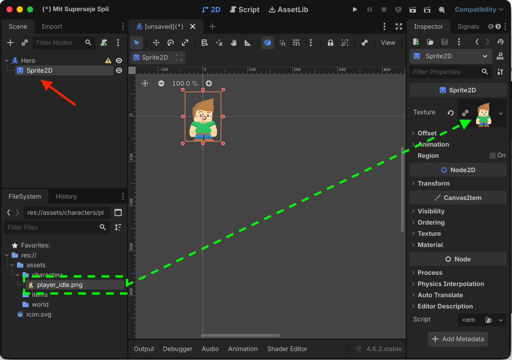
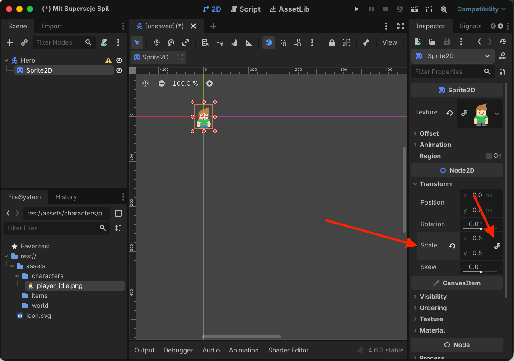
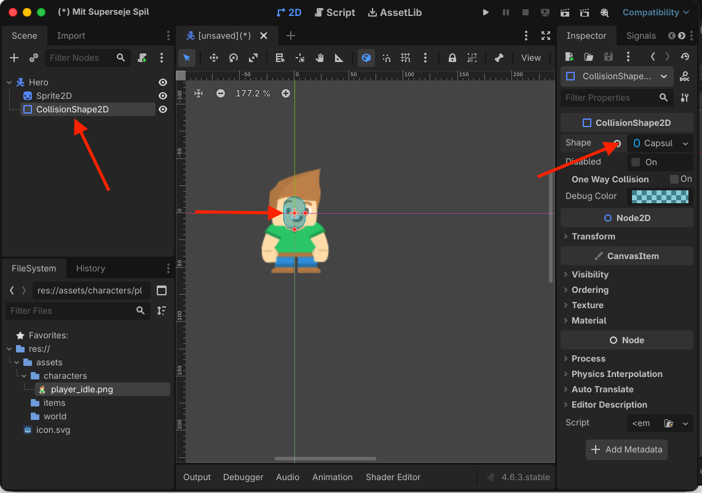
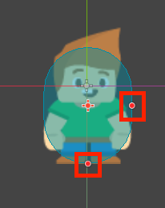
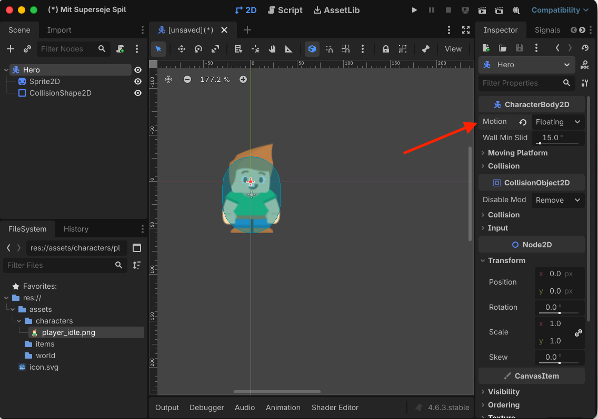
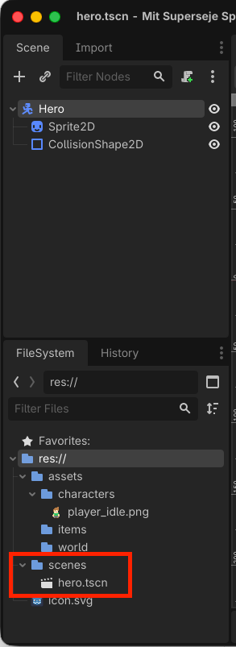

# Sådan bygger du en Hero med et enkelt billede

*Lav en spillerfigur med en sprite og collision, som senere kan bevæge sig rundt i dit spil.*

## 🎯 Målet med guiden

Når du er færdig, har du:

- lavet en scene til din Hero
- givet Hero et billede
- lavet collision omkring figuren
- gemt Hero som en scene, der kan bruges i dine baner

Denne guide bruger **ét enkelt billede** til Hero.

Hvis din figur ligger i et spritesheet og skal animeres, skal du i stedet bruge guiden:

**Sådan bygger du en Hero med animation**

---

## 🧩 Trin 1: Opret Hero-scenen

Opret en ny scene i Godot.

1. Klik **Other Node**.
2. Søg efter `CharacterBody2D`.
3. Vælg **CharacterBody2D**.
4. Omdøb noden til (dobbeltklik på noden for at omdøbe):

```text
Hero
```

`CharacterBody2D` er lavet til figurer, der skal kunne bevæge sig og støde ind i ting.


> *Hero bruger CharacterBody2D som root-node.*

---

## 🖼️ Trin 2: Tilføj et billede

Hero skal have noget grafik.

1. Klik på `Hero`.
2. Tilføj en ny child-node (klik på det lille `+` lige ovenover).
3. Vælg:

```text
Sprite2D
```

Dit scene-træ skal nu se sådan ud:

```text
Hero
└── Sprite2D
```

Find billedet af din spillerfigur i **FileSystem**.

Træk billedet over på feltet **Texture** på `Sprite2D` i **Inspector**.


> *Sprite2D viser billedet af spillerfiguren.*

---

## 📏 Trin 3: Tjek størrelsen

Se på din Hero i 2D-vinduet.

Hvis figuren er meget stor eller meget lille, kan du ændre størrelsen på `Sprite2D`.

> Det kan være svært at se nu om din figur har den rigtige størrelse. Vend tilbage til denne del af guide, hvis du senere finder ud af, at figuren er for stor eller for lille.

1. Marker `Sprite2D`.
2. Find **Transform** i Inspector.
3. Find **Scale**.
4. Ændr `X` og `Y` med samme værdi.

For eksempel:

```text
X: 2
Y: 2
```

gør figuren dobbelt så stor.

```text
X: 0.5
Y: 0.5
```

gør figuren halvt så stor.

> **📌 Tip:**  
> Brug samme værdi til `X` og `Y`, så billedet ikke bliver skævt. Klik på det lille kæde-ikon, så følges værdierne altid ad.


> *Scale kan bruges til at ændre figurens størrelse.*

---

## 🧱 Trin 4: Tilføj collision

Hero skal senere kunne støde ind i vægge og andre ting.

Tilføj derfor en collision-form.

1. Marker `Hero`.
2. Tilføj en child-node.
3. Vælg:

```text
CollisionShape2D
```

Scene-træet skal nu se sådan ud:

```text
Hero
├── Sprite2D
└── CollisionShape2D
```

---

## 🔵 Trin 5: Vælg en collision-form

Marker `CollisionShape2D`.

I Inspector finder du feltet **Shape**.

Vælg for eksempel:

```text
New CapsuleShape2D
```

eller:

```text
New RectangleShape2D
```

Der vises nu en form omkring Hero i 2D-vinduet.


> *CollisionShape2D bestemmer, hvor Hero kan støde ind i andre ting.*

---

## 👣 Trin 6: Tilpas collision til Hero

Collision behøver ikke dække hele billedet.

I et top-down-spil er det ofte bedst, hvis collision hovedsageligt ligger omkring:

- fødderne
- benene
- den nederste del af kroppen

Så føles det mere naturligt, når Hero går tæt forbi vægge og andre objekter.

Brug håndtagene på collision-formen til at ændre dens størrelse.

Flyt den, hvis det er nødvendigt.


> *Collision behøver ikke følge hele billedets størrelse.*

---

## 🧭 Trin 7: Sæt Motion Mode

Marker `Hero`.

Find:

**Motion Mode**

i Inspector.

Sæt den til `Floating` eller `Grounded`
- `Floating` passer godt til top-down-spil, hvor figuren kan bevæge sig frit i alle retninger.
- `Grounded` passer godt til platform-spil, hvor figuren kan springe og hoppe.


> *Floating bruges til fri bevægelse i et top-down-spil.*

---

## 💾 Trin 8: Gem Hero

Tryk:

```text
Ctrl + S (Cmd + S på Mac)
```

Gem scenen som:

```text
hero.tscn
```

Du kan for eksempel gemme den i:

```text
res://scenes/hero.tscn
```

Hvis mappen `scenes` ikke findes endnu, kan du oprette den.


> *Hero er gemt som sin egen scene og kan bruges i andre scener.*

---

## 🔍 STOP OG TEST

Kontroller følgende:

- [ ] Root-noden hedder `Hero`.
- [ ] Hero er en `CharacterBody2D`.
- [ ] Hero har en `Sprite2D`.
- [ ] Jeg kan se mit eget billede på `Sprite2D`.
- [ ] Hero har en `CollisionShape2D`.
- [ ] Collision-formen passer nogenlunde til figuren.
- [ ] Motion Mode er sat til `Floating`.
- [ ] Scenen er gemt som `hero.tscn`.

---

## ❌ Hvis noget ikke virker

**Jeg kan ikke se min Hero**  
Kontroller, at dit billede ligger i feltet **Texture** på `Sprite2D`.

**Der står en advarsel ved CollisionShape2D**  
Kontroller, at du har valgt en **Shape**.

**Collision er meget større end Hero**  
Marker `CollisionShape2D` og tilpas formen i 2D-vinduet.

**Min Hero ser strakt ud**  
Kontroller, at `Scale X` og `Scale Y` har samme værdi.

---

## 🎉 Færdig

Din Hero har nu:

- grafik
- collision
- sin egen scene

Den kan endnu ikke bevæge sig.

Det laver du i guiden:

**Sådan får du din Hero til at bevæge sig**