# Sådan bygger du en Hero med animation

*Lav en spillerfigur med flere billeder fra et spritesheet og saml dem til en animation.*

## 🎯 Målet med guiden

Når du er færdig, har du:

- lavet en scene til din Hero
- tilføjet en `AnimatedSprite2D`
- hentet billeder ud af et spritesheet
- lavet en simpel animation
- lavet collision omkring Hero
- gemt Hero som en scene

Denne guide er til dig, der har en figur med **flere animationsbilleder**.

Hvis du kun har ét billede af din figur, kan du bruge guiden:

**Sådan bygger du en Hero med et enkelt billede**

---

## 🧩 Trin 1: Opret Hero-scenen

Opret en ny scene i Godot.

1. Klik **Other Node**.
2. Søg efter:

```text
CharacterBody2D
```

3. Vælg `CharacterBody2D`.
4. Omdøb noden til:

```text
Hero
```

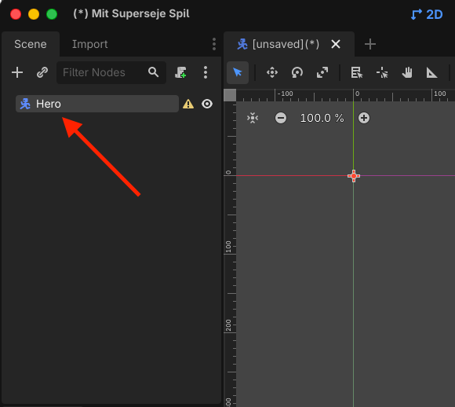
> *Hero bruger CharacterBody2D som root-node.*

---

## 🎞️ Trin 2: Tilføj AnimatedSprite2D

Hero skal bruge flere billeder.

1. Marker `Hero`.
2. Tilføj en child-node (klik på det lille `+` over `Hero`).
3. Vælg:

```text
AnimatedSprite2D
```

Scene-træet skal nu se sådan ud:

```text
Hero
└── AnimatedSprite2D
```

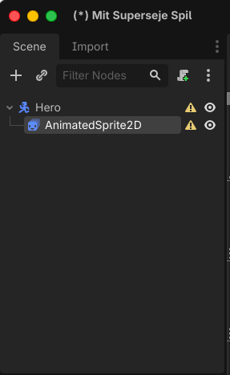
> *AnimatedSprite2D kan vise flere billeder som en animation.*

---

## 🎬 Trin 3: Opret SpriteFrames

Marker `AnimatedSprite2D`.

Find feltet:

**Sprite Frames**

i Inspector.

1. Klik på feltet.
2. Vælg:

```text
New SpriteFrames
```

3. Klik på den nye `SpriteFrames`-ressource.

Panelet **SpriteFrames** åbner nederst i Godot.

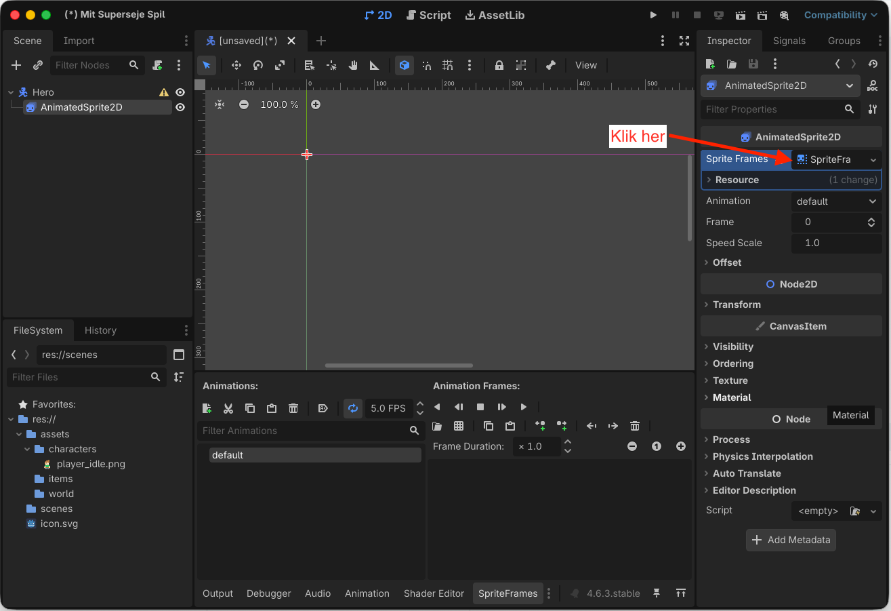
> *SpriteFrames holder styr på Hero-animationerne.*

---

## ✏️ Trin 4: Omdøb animationen

Godot laver normalt automatisk en animation med navnet:

```text
default
```

Omdøb den til (dobbeltklik på `default` for at omdøbe):

```text
idle
```

`idle` betyder, at figuren står stille.

Du kan senere lave flere animationer som for eksempel:

```text
walk
walk_up
walk_down
walk_side
```

I denne guide starter vi kun med én animation.

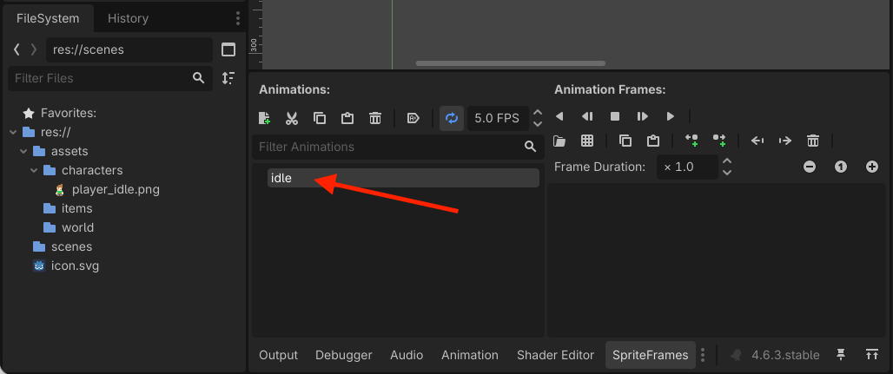
> *Den første animation kaldes idle.*

---

## 🖼️ Trin 5: Find dit spritesheet

Find spritesheetet med din figur i **FileSystem**.

> Hvis du ikke har et spritesheet, men i stedet enkeltstående billeder, skal du springe til trin 8.

Et spritesheet kan for eksempel se sådan ud:

```text
[ frame 1 ][ frame 2 ][ frame 3 ][ frame 4 ]
```

eller som et større grid med flere rækker.

Du skal nu fortælle Godot, hvilke dele af billedet der skal bruges som enkelte frames.

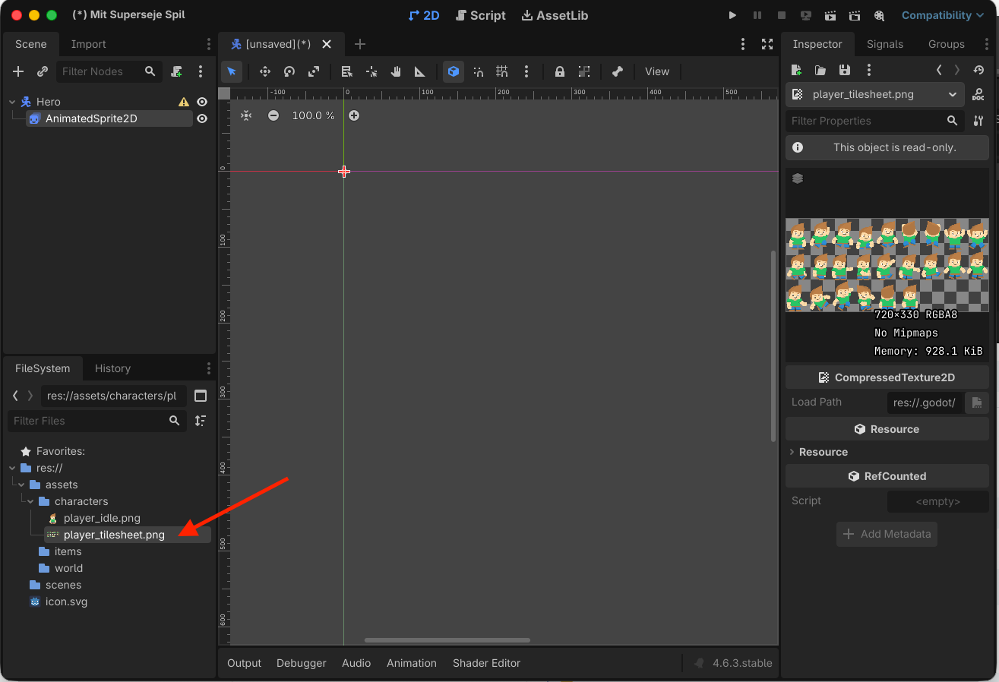
> *Et spritesheet indeholder flere frames i samme billede.*

---

## ✂️ Trin 6: Tilføj frames fra spritesheetet

I **SpriteFrames-panelet** skal du vælge funktionen til at:

**Add frames from a Sprite Sheet**

Vælg dit spritesheet.

Godot viser nu billedet og et grid.

Du skal indstille, hvordan spritesheetet skal deles op.

Det kan for eksempel være:

```text
4 kolonner
1 række
```

eller:

```text
4 kolonner
4 rækker
```

Det afhænger af dit spritesheet.

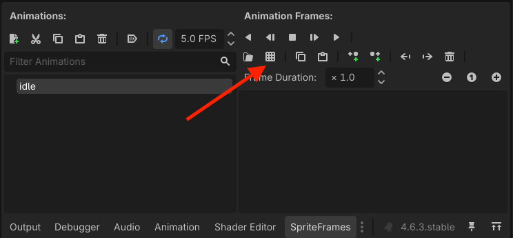
> *Vælg at du vil tilføje fra et spritesheet*

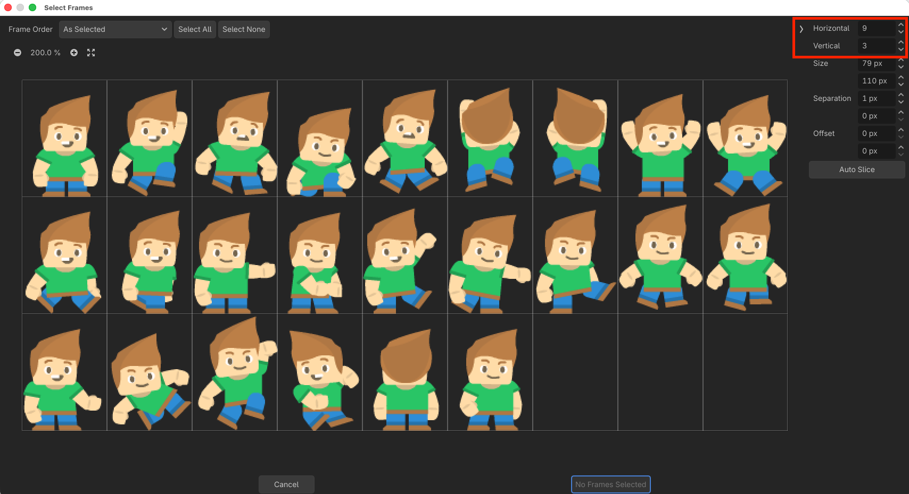
> *Godot deler spritesheetet op i enkelte animationsframes.*

---

## ✅ Trin 7: Vælg de rigtige frames

Klik på de billeder, der skal være med i din `idle`-animation.

Vælg kun de frames, der hører sammen.

Tilføj dem til animationen.

De valgte billeder vises nu efter hinanden i **SpriteFrames-panelet**.

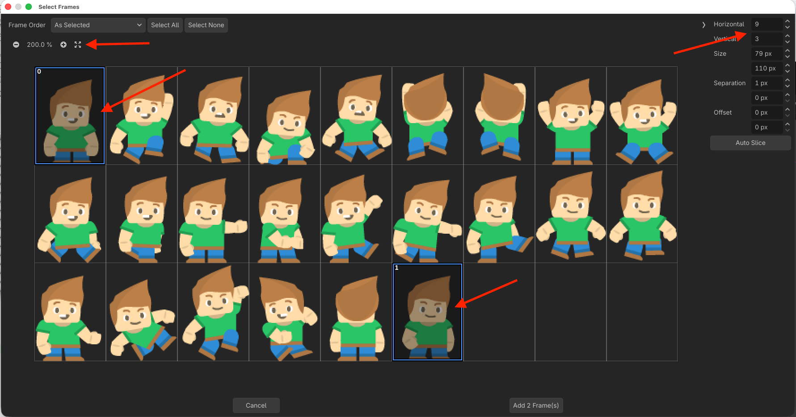
> *Animationen består af de frames, du har valgt fra spritesheetet.*

---

## Trin 8: Lav animationen med enkelte billeder

Hvis du ikke har et spritesheet, men i stedet har flere enkelte billeder, der skal animeres, så følg dette trin. Ellers skal du springe det over.

Sørg for at du har dine billeder i din `assets/hero` mappe.

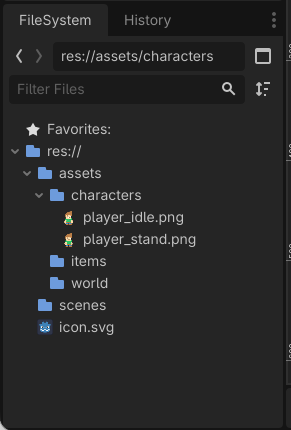
> *Hav dine billeder klar*

Nu skal du trække billederne ind i **SpriteFrames-panelet**.

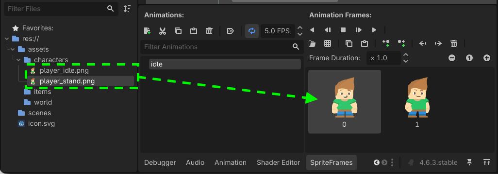
> *Træk billeder ind i SpriteFrames-panelet.*

## ▶️ Trin 9: Afspil animationen

Marker `AnimatedSprite2D`.

Sørg for, at animationen er:

```text
idle
```

Slå:

**Autoplay**

til.

Sørg også for, at animationen gentager sig, hvis den skal køre hele tiden.

Tryk på **Play** i SpriteFrames-panelet for at se animationen.

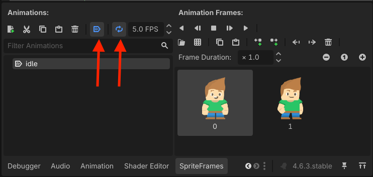
> *Autoplay får idle-animationen til at starte automatisk.*

---

## ⏱️ Trin 9: Tilpas hastigheden

Hvis animationen går for hurtigt eller langsomt, kan du ændre dens hastighed.

Find animationens:

**FPS**

FPS betyder:

**Frames Per Second**

Et lavt tal giver en langsommere animation.

Et højere tal giver en hurtigere animation.

Prøv for eksempel:

```text
4 FPS
```

eller:

```text
6 FPS
```

og se, hvad der passer til din figur.

> **📌 Tip:**  
> Animationen behøver ikke være hurtig. En idle-animation fungerer ofte bedst med få frames og rolig bevægelse.

---

## 📏 Trin 10: Tjek Heroens størrelse

Hvis Hero er meget stor eller lille, kan du ændre størrelsen på `AnimatedSprite2D`.

> Det kan være svært at se nu om din figur har den rigtige størrelse. Vend tilbage til denne del af guide, hvis du senere finder ud af, at figuren er for stor eller for lille.

1. Marker `AnimatedSprite2D`.
2. Find **Transform** i Inspector.
3. Find **Scale**.
4. Ændr `X` og `Y` med samme værdi.

For eksempel:

```text
X: 2
Y: 2
```

gør figuren dobbelt så stor.

```text
X: 0.5
Y: 0.5
```

gør figuren halvt så stor.

> **📌 Tip:**  
> Brug samme værdi til `X` og `Y`, så billedet ikke bliver skævt. Klik på det lille kæde-ikon, så følges værdierne altid ad.

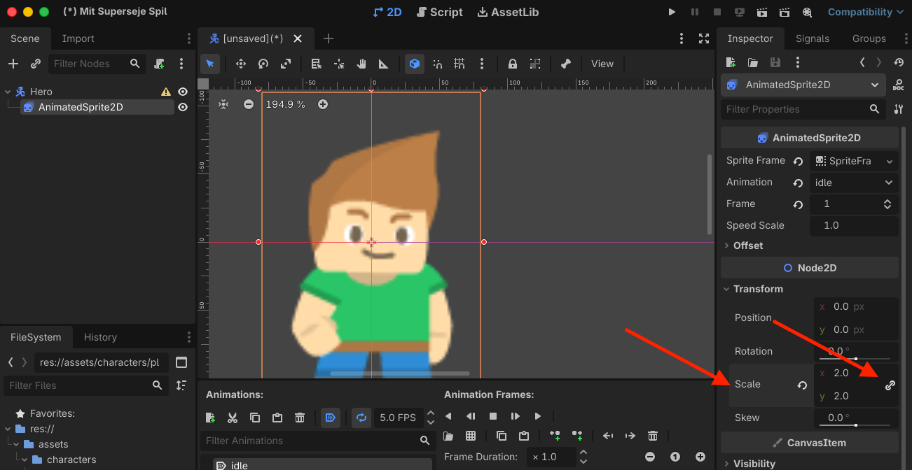
> *Scale kan bruges til at ændre figurens størrelse.*

---

## 🧱 Trin 11: Tilføj collision

Hero skal senere kunne støde ind i vægge og andre objekter.

1. Marker `Hero`.
2. Tilføj:

```text
CollisionShape2D
```

Scene-træet skal nu se sådan ud:

```text
Hero
├── AnimatedSprite2D
└── CollisionShape2D
```

Marker `CollisionShape2D`.

Vælg for eksempel:

```text
New CapsuleShape2D
```

eller:

```text
New RectangleShape2D
```

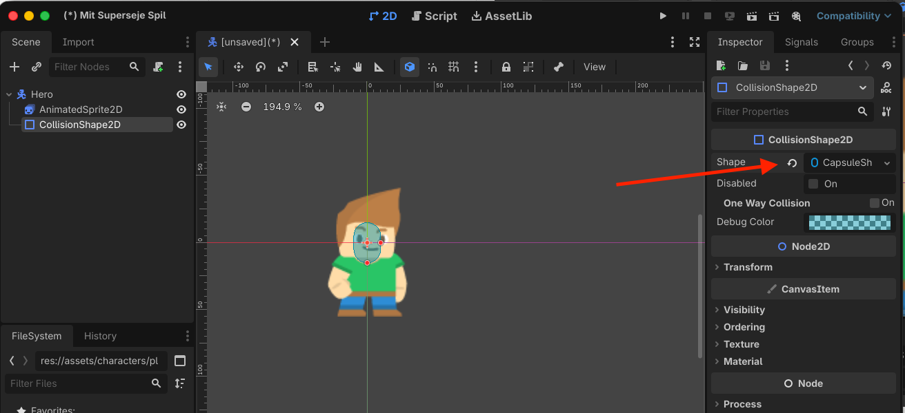
> *CollisionShape2D bestemmer Heroens fysiske størrelse.*

---

## 👣 Trin 12: Tilpas collision

Collision behøver ikke dække hele figuren.

I et top-down-spil kan du placere den omkring:

- fødderne
- benene
- den nederste del af kroppen

Det betyder, at Hero senere kan gå tættere forbi vægge og andre objekter.

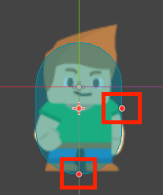
> *En mindre collision omkring fødderne fungerer godt i et top-down-spil.*

---

## 🧭 Trin 13: Sæt Motion Mode

Marker `Hero`.

Find:

**Motion Mode**

i Inspector.

Sæt den til `Floating` eller `Grounded`
- `Floating` passer godt til top-down-spil, hvor figuren kan bevæge sig frit i alle retninger.
- `Grounded` passer godt til platform-spil, hvor figuren kan springe og hoppe.


> *Floating bruges til fri bevægelse i et top-down-spil.*

---

## 💾 Trin 14: Gem Hero

Tryk:

```text
Ctrl + S
```

Gem scenen som:

```text
res://scenes/hero.tscn
```


> *Den animerede Hero er gemt som sin egen scene.*

---

## 🔍 STOP OG TEST

Kontroller følgende:

- [ ] Root-noden hedder `Hero`.
- [ ] Hero er en `CharacterBody2D`.
- [ ] Hero har en `AnimatedSprite2D`.
- [ ] Jeg har oprettet en `SpriteFrames`-ressource.
- [ ] Min animation hedder `idle`.
- [ ] Animationen indeholder de rigtige frames.
- [ ] Animationen kan afspilles.
- [ ] Hero har en `CollisionShape2D`.
- [ ] Collision passer nogenlunde til figuren.
- [ ] Motion Mode er sat til `Floating`.
- [ ] Scenen er gemt som `hero.tscn`.

---

## ❌ Hvis noget ikke virker

**Hele spritesheetet vises som ét billede**  
Du skal bruge **Add frames from a Sprite Sheet** og dele billedet op i et grid.

**Mine frames indeholder dele af flere figurer**  
Kontroller antallet af rækker og kolonner.

**Animationen står stille**  
Kontroller, at der er flere frames, og at **Autoplay** er slået til.

**Animationen går alt for hurtigt**  
Sænk animationens FPS.

**Hero hopper rundt, når animationen spiller**  
Kontroller, om figuren står samme sted inde i hver frame på spritesheetet.

**Der står en advarsel ved CollisionShape2D**  
Kontroller, at du har valgt en Shape.

---

## 🎉 Færdig

Din Hero har nu:

- animation
- collision
- sin egen genbrugelige scene

Den kan endnu ikke bevæge sig rundt i banen.

Det laver du i guiden:

**Sådan får du din Hero til at bevæge sig**