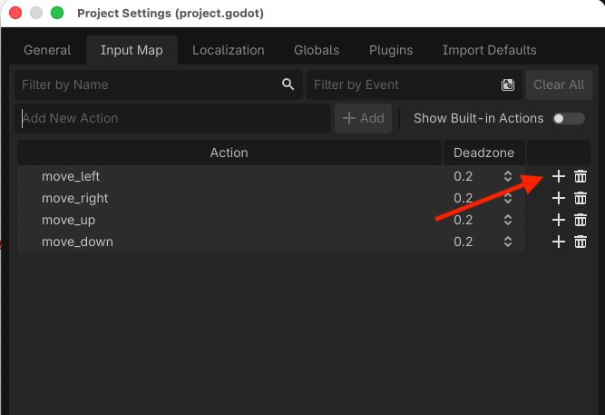
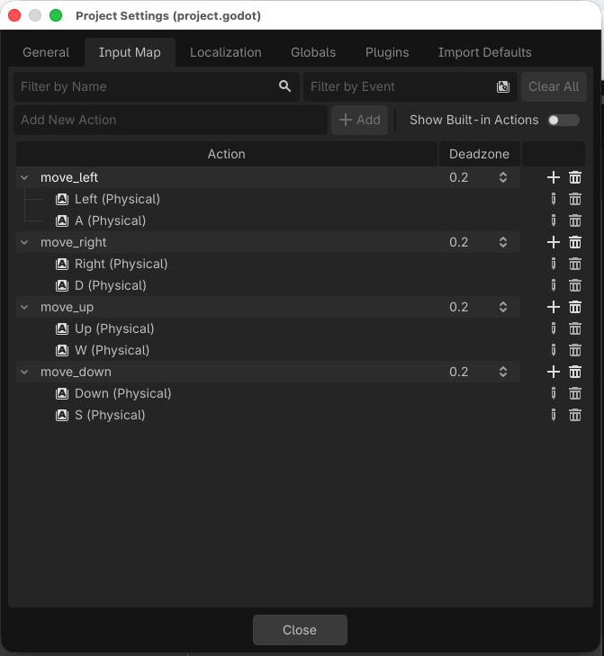
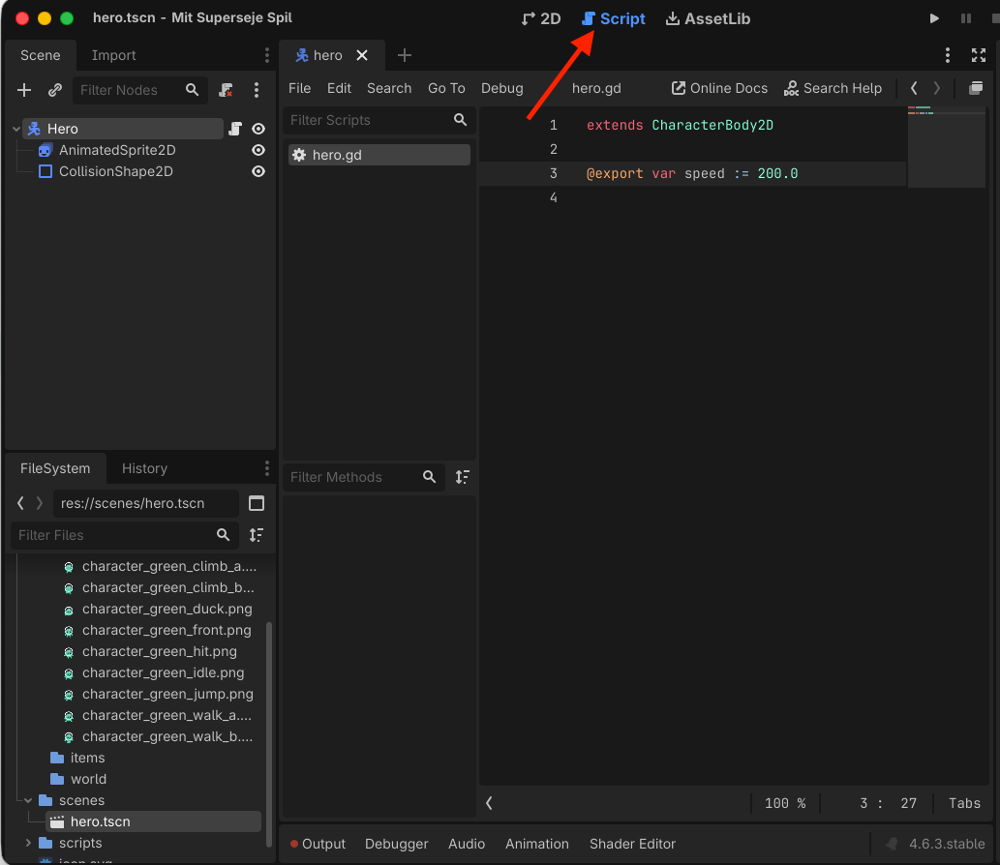
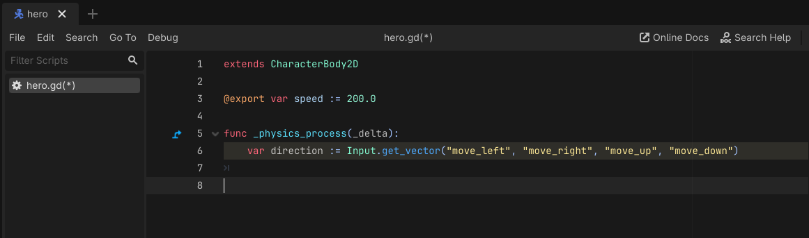
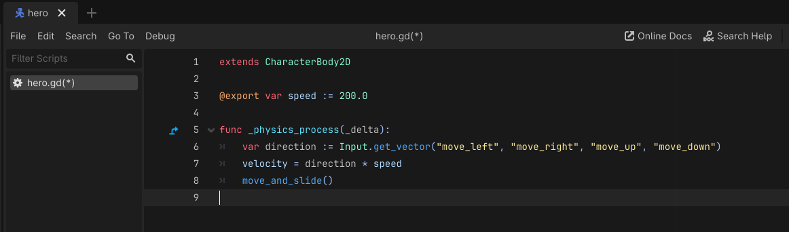
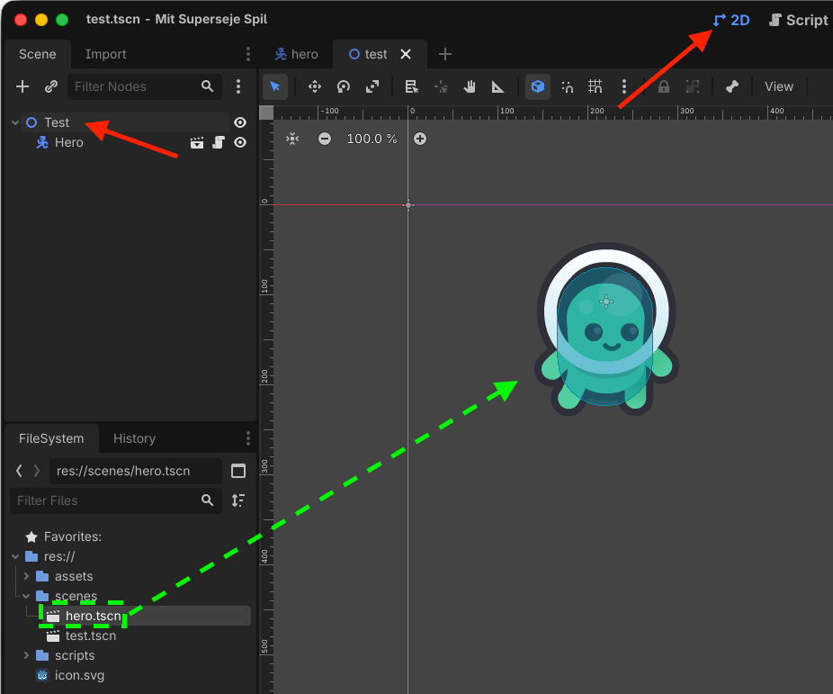
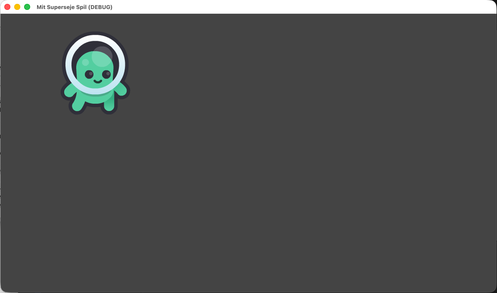
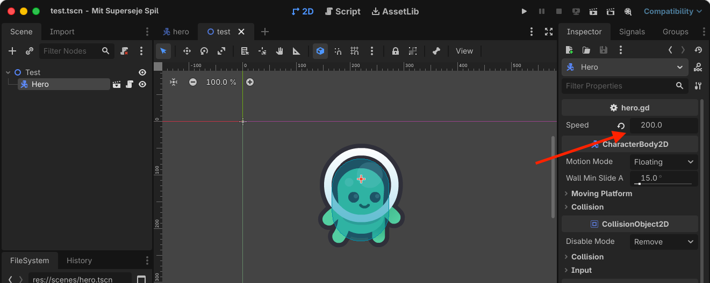

# Sådan får du din Hero til at bevæge sig (top-down)

*St
yr din Hero med WASD eller piletasterne, så den kan bevæge sig rundt i spillet.*

## 🎯 Målet med guiden

Når du er færdig, har du:

- lavet styring med **WASD** og **piletasterne**
- oprettet bevægelse i **Input Map**
- lavet et script til din Hero
- brugt `Input.get_vector()` til at læse spillerens input
- brugt `move_and_slide()` til at flytte Hero
- testet, at Hero kan bevæge sig i alle retninger

Denne guide virker både med:

- **Hero med et enkelt billede**
- **Hero med animation**

---

## 🎮 Trin 1: Åbn Input Map

Først skal Godot vide, hvilke taster der skal styre Hero.

Åbn:

```text
Project → Project Settings
```

Find derefter fanen:

```text
Input Map
```

> *Input Map bruges til at bestemme, hvilke taster der styrer spillet.*

---

## ⬅️ Trin 2: Opret fire bevægelser

Lav disse fire actions i **Input Map**:

```text
move_left
move_right
move_up
move_down
```

Skriv ét navn ad gangen og tilføj det som en ny action.

Når du er færdig, skal alle fire navne stå på listen.

> **📌 Tip:**  
> Brug præcis de samme navne som i guiden (OGSÅ STORE OG SMÅ BOGSTAVER). Scriptet skal bruge dem senere.


> *Vi laver én action til hver bevægelsesretning.*

---

## ⌨️ Trin 3: Tilføj WASD og piletaster

Tilføj to taster til hver action.

Brug denne opsætning:

```text
move_left   → A + venstre pil
move_right  → D + højre pil
move_up     → W + pil op
move_down   → S + pil ned
```

Klik på den enkelte action, og tilføj et keyboard-input til hver tast ved at klikke på `+`-knappen til højre for navnet.

Efter du har klikket på `+`-knappen, skal du trykke på den tast, du vil tilføje og derefter klikke på `OK`. Så du kan fx gøre:

1. Klik på `+` ud for `move_left`
2. Klik på venstre piletast på dit tastatur
3. Klik på `OK`
4. Gentag for alle de piletaster du vil bruge til alle bevægelser

Når du er færdig, kan spilleren bruge både **WASD** og **piletasterne**.



> *Hver retning kan styres med både WASD og piletasterne.*

---

## 🧩 Trin 4: Åbn Hero-scenen

Find din Hero-scene i **FileSystem**.

Den hedder sandsynligvis:

```text
hero.tscn
```

Åbn scenen.

Root-noden skal være:

```text
Hero
```

og den skal være en:

```text
CharacterBody2D
```

Det er vigtigt, fordi `CharacterBody2D` har de funktioner, vi skal bruge til bevægelse.


> *Bevægelsen bliver lavet på Heroens CharacterBody2D.*

---

## 📜 Trin 5: Tilføj et script til Hero

Marker `Hero`.

Klik på knappen til at **Attach Script**.

Opret et nyt script med navnet:

```text
hero.gd
```

Du kan for eksempel gemme det som:

```text
res://scripts/hero.gd
```

Hvis mappen `scripts` ikke findes, kan du oprette den først.


> *Hero får sit eget script, som styrer bevægelsen.*

---

## ⚡ Trin 6: Lav en hastighed

Øverst i scriptet skal der stå:

```gdscript
extends CharacterBody2D

@export var speed := 200.0
```

`speed` bestemmer, hvor hurtigt Hero bevæger sig.

Tallet:

```text
200
```

betyder cirka 200 pixels i sekundet.

Fordi vi bruger `@export`, kan du også ændre hastigheden i **Inspector** senere.


> *Speed bestemmer, hvor hurtigt Hero bevæger sig.*

---

## 🧭 Trin 7: Find den retning spilleren trykker

Tilføj nu denne funktion under din `speed`:

```gdscript
func _physics_process(_delta):
    var direction := Input.get_vector("move_left", "move_right", "move_up", "move_down")
```

`_physics_process()` kører igen og igen, mens spillet er i gang.

`Input.get_vector()` ser på de fire actions fra **Input Map** og laver en retning.

For eksempel:

```text
A eller venstre pil  → venstre
D eller højre pil    → højre
W eller pil op       → op
S eller pil ned      → ned
```

Hvis du trykker to retninger samtidig, kan Hero også bevæge sig diagonalt.

> **📌 Tip:**  
> `Input.get_vector()` sørger automatisk for, at diagonal bevægelse ikke bliver hurtigere end bevægelse lige op, ned eller til siden.


> *Input.get_vector() samler de fire retninger til én bevægelsesretning.*

---

## 🏃 Trin 8: Giv Hero fart

Tilføj denne linje inde i `_physics_process()`:

```gdscript
velocity = direction * speed
```

`velocity` betyder Heroens bevægelseshastighed og retning.

Hvis spilleren ikke trykker på noget, bliver `direction` nul.

Så bliver `velocity` også nul, og Hero står stille.

---

## 🚶 Trin 9: Flyt Hero

Tilføj til sidst:

```gdscript
move_and_slide()
```

Hele scriptet skal nu se sådan ud:

```gdscript
extends CharacterBody2D

@export var speed := 200.0

func _physics_process(_delta):
    var direction := Input.get_vector("move_left", "move_right", "move_up", "move_down")
    velocity = direction * speed
    move_and_slide()
```

`move_and_slide()` flytter `CharacterBody2D` ved hjælp af dens `velocity`.

Senere vil den samme funktion også hjælpe Hero med at reagere på collision med vægge.


> *Det færdige script læser input, laver velocity og flytter Hero.*

---

## 🧪 Trin 10: Lav en lille testscene

Du har endnu ikke bygget din rigtige bane, så lav en enkel scene til at teste bevægelsen i.

1. Opret en ny **2D Scene**.
2. Omdøb root-noden til:

```text
Test
```

3. Træk `hero.tscn` fra **FileSystem** ind i scenen.
4. Flyt Hero nogenlunde ind på midten af 2D-vinduet.
5. Gem scenen som for eksempel:

```text
test.tscn
```

Dit scene-træ kan se sådan ud:

```text
Test
└── Hero
```


> *En lille testscene gør det nemt at afprøve Heroens bevægelse.*

---

## ▶️ Trin 11: Test bevægelsen

Kør den aktuelle scene ved at klikke på det lille film-ikon.

Prøv først:

```text
W A S D
```

Prøv derefter:

```text
piletasterne
```

Hero skal kunne bevæge sig:

- til venstre
- til højre
- op
- ned
- diagonalt

Når du slipper tasterne, skal Hero stoppe.



> *Hero kan nu styres med WASD eller piletasterne.*

---

## 🐢 Trin 12: Tilpas hastigheden

Hvis Hero bevæger sig for hurtigt eller for langsomt, kan du ændre `speed`.

Prøv for eksempel:

```text
100
```

for langsommere bevægelse.

Eller:

```text
300
```

for hurtigere bevægelse.

Fordi `speed` bruger `@export`, kan du markere `Hero` og ændre værdien direkte i **Inspector**.

> **📌 Tip:**  
> Vælg en hastighed, der føles god sammen med størrelsen på din figur og de tiles, du senere vil bruge i banen.


> *Speed kan justeres i Inspector uden at ændre scriptet.*

---

## 🔍 STOP OG TEST

Kontroller følgende:

- [ ] Jeg har lavet `move_left`, `move_right`, `move_up` og `move_down` i Input Map.
- [ ] Jeg kan bruge både WASD og piletasterne.
- [ ] Hero har et `hero.gd`-script.
- [ ] Scriptet bruger `Input.get_vector()`.
- [ ] Scriptet sætter `velocity`.
- [ ] Scriptet bruger `move_and_slide()`.
- [ ] Hero kan bevæge sig i alle fire retninger.
- [ ] Hero kan bevæge sig diagonalt.
- [ ] Hero stopper, når jeg slipper tasterne.
- [ ] Jeg har fundet en hastighed, der føles passende.

---

## ❌ Hvis noget ikke virker

**Hero bevæger sig slet ikke**  
Kontroller, at scriptet er sat på `Hero`, og at `Hero` er en `CharacterBody2D`.

**Der kommer en fejl om `move_left` eller en anden action**  
Kontroller, at navnene i **Input Map** er skrevet præcis som i scriptet.

**WASD virker, men piletasterne virker ikke**  
Kontroller, at du har tilføjet begge taster til hver action.

**Hero bevæger sig den forkerte vej**  
Kontroller rækkefølgen i `Input.get_vector()`:

```gdscript
Input.get_vector("move_left", "move_right", "move_up", "move_down")
```

**Hero bevæger sig alt for hurtigt eller langsomt**  
Juster `speed` i Inspector eller i scriptet.

**Min animerede Hero viser kun idle-animationen, mens den bevæger sig**  
Det er helt fint i denne guide. Her laver du kun selve bevægelsen. Du kan senere koble bevægelsen sammen med flere animationer.

**Hero kan gå ud af skærmen**  
Det er også normalt lige nu. Du har endnu ikke lavet en bane med vægge og collision.

---

## 🎉 Færdig

Din Hero kan nu:

- læse input fra tastaturet
- finde en bevægelsesretning
- bevæge sig med en bestemt hastighed
- bruge `move_and_slide()`

Du har nu den grundlæggende spillerstyring på plads.

Næste guide er:

**Sådan laver du et TileSet**
