# Sådan får du din Hero til at bevæge sig i et platformspil

*Få din Hero til at gå til venstre og højre, falde med tyngdekraften og hoppe op på platforme.*

## 🎯 Målet med guiden

Når du er færdig, har du:

- sat Hero til **Grounded** bevægelse
- lavet styring til venstre og højre
- lavet en **jump**-action i Input Map
- tilføjet tyngdekraft til Hero
- brugt `is_on_floor()` til at kontrollere, om Hero må hoppe
- brugt `move_and_slide()` til at flytte Hero
- testet bevægelsen på en simpel platform

Denne guide er til et **platformspil**, hvor Hero bevæger sig til siderne og kan hoppe.

Hvis Hero i stedet skal kunne bevæge sig frit op, ned, til venstre og til højre, skal du bruge top-down-versionen af guide om bevægelse.

Denne guide virker både med:

- **Hero med et enkelt billede**
- **Hero med animation**

---

## 🧩 Trin 1: Åbn Hero-scenen

Find din Hero-scene i **FileSystem**.

Den hedder sandsynligvis:

```text
hero.tscn
```

Åbn scenen.

Root-noden skal være:

```text
Hero
```

og den skal være en:

```text
CharacterBody2D
```

`CharacterBody2D` passer godt til en figur, som spilleren selv styrer med kode.

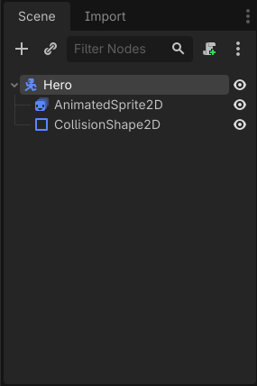
> *Platformbevægelsen bliver lavet på Heroens CharacterBody2D.*

---

## 🧭 Trin 2: Sæt Motion Mode til Grounded

Marker `Hero`.

Find:

**Motion Mode**

i Inspector.

Sæt den til:

```text
Grounded
```

`Grounded` passer til platformspil, fordi Godot så kan kende forskel på:

- gulv
- vægge
- loft

Det gør det muligt at spørge Godot, om Hero står på jorden med:

```gdscript
is_on_floor()
```

Hvis du tidligere satte Hero til `Floating`, skal du ændre den til `Grounded` nu.

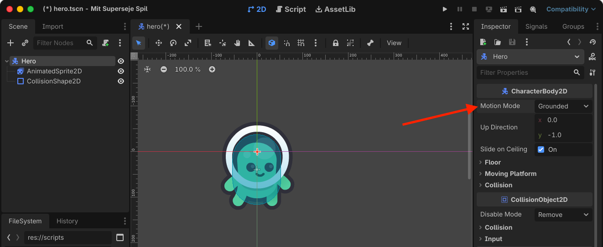
> *Grounded bruges til bevægelse, hvor gulv, vægge og loft skal kunne skelnes fra hinanden.*

---

## 🎮 Trin 3: Åbn Input Map

Nu skal Godot vide, hvilke taster der skal styre Hero.

Åbn:

```text
Project → Project Settings
```

Find fanen:

```text
Input Map
```

Her kan du lave dine egne input-navne til spillet.

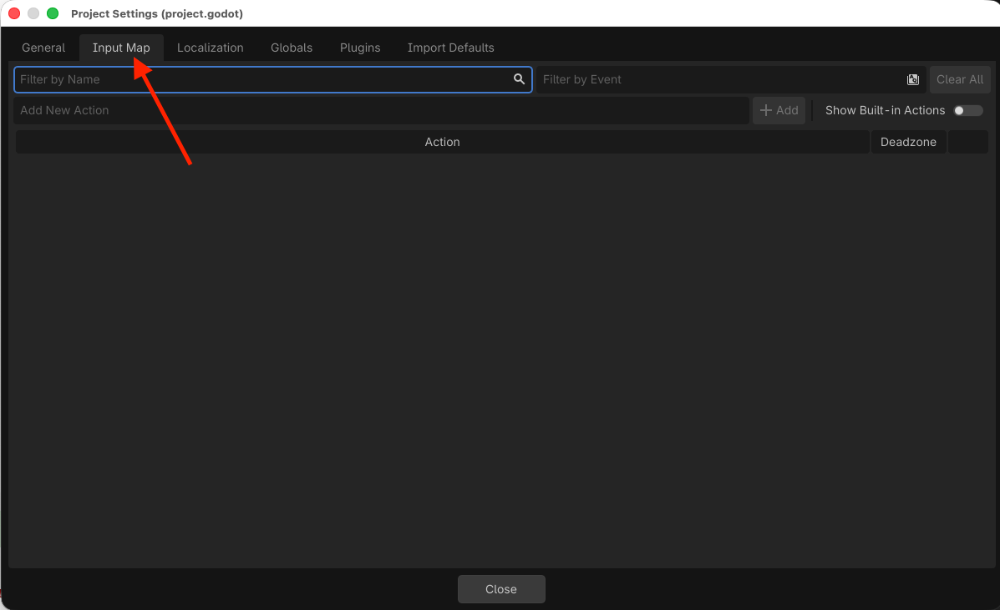
> *Input Map bruges til at bestemme, hvilke taster der styrer Hero.*

---

## ⬅️ Trin 4: Opret tre actions

Lav disse tre actions i **Input Map**:

```text
move_left
move_right
jump
```

Skriv ét navn ad gangen og tilføj det som en ny action.

Når du er færdig, skal alle tre navne stå på listen.

> **📌 Tip:**  
> Brug præcis de samme navne som i guiden (OGSÅ STORE OG SMÅ BOGSTAVER). Scriptet skal bruge dem senere.

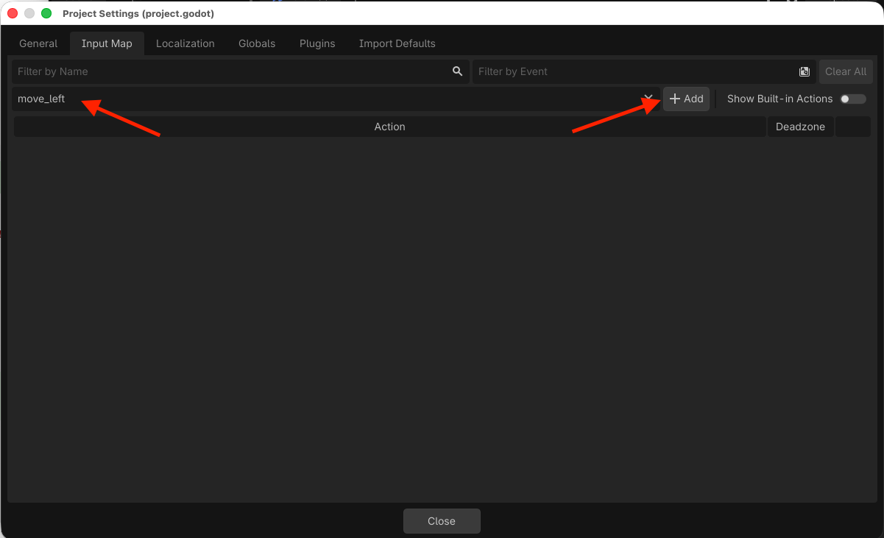
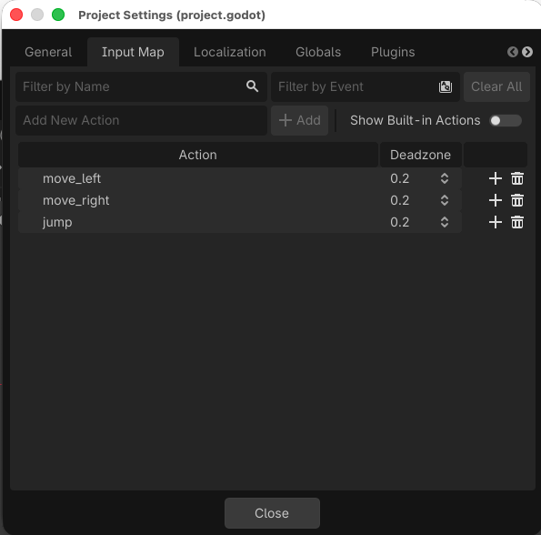
> *Et platformspil har brug for vandret bevægelse og en action til hop.*

---

## ⌨️ Trin 5: Tilføj taster

Tilføj taster til de tre actions.

Du kan bruge denne opsætning:

```text
move_left   → A + venstre pil
move_right  → D + højre pil
jump        → Space + W + pil op
```

Du behøver ikke bruge alle tre hop-taster, men det kan være praktisk, hvis både WASD og piletaster skal virke.

Klik på den enkelte action, og tilføj et keyboard-input til hver tast ved at klikke på `+`-knappen til højre for navnet.

Efter du har klikket på `+`-knappen, skal du trykke på den tast, du vil tilføje og derefter klikke på `OK`. Så du kan fx gøre:

1. Klik på `+` ud for `move_left`
2. Klik på venstre piletast på dit tastatur
3. Klik på `OK`
4. Gentag for alle de piletaster du vil bruge til alle bevægelser

Når du er færdig, kan spilleren gå til siderne og hoppe.

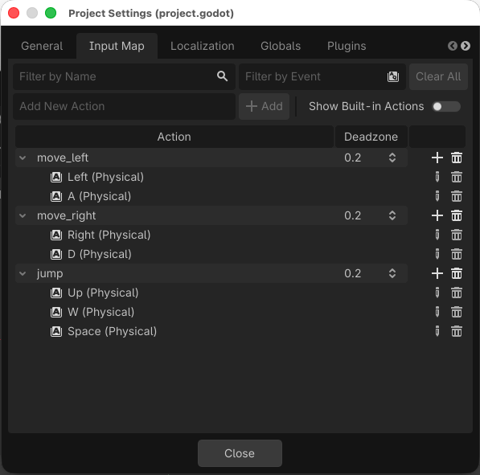
> *Hero kan styres til siderne og får en separat tast til hop.*

---

## 📜 Trin 6: Tilføj et script til Hero

Marker `Hero`.

Klik på knappen til at **Attach Script**.

Opret et nyt script med navnet:

```text
hero.gd
```

Du kan for eksempel gemme det som:

```text
res://scripts/hero.gd
```

Hvis Hero allerede har et bevægelsesscript fra top-down-guiden, skal du erstatte bevægelseskoden med koden i denne guide.

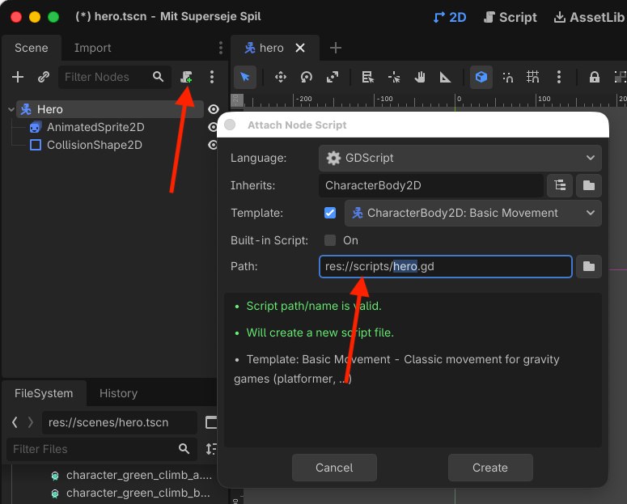
> *Hero får et script, som styrer platformbevægelsen.*

---

## ⚡ Trin 7: Lav fart og hopstyrke

Start scriptet sådan:

```gdscript
extends CharacterBody2D

@export var speed := 200.0
@export var jump_speed := 400.0
```

`speed` bestemmer, hvor hurtigt Hero går til venstre og højre.

`jump_speed` bestemmer, hvor kraftigt Hero hopper.

Fordi begge værdier bruger `@export`, kan du senere ændre dem direkte i **Inspector**.

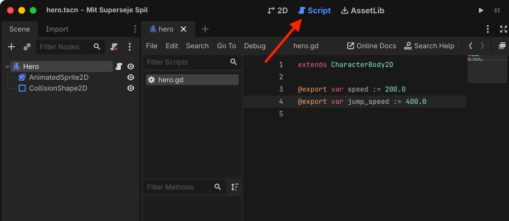
> *Speed styrer ganghastigheden, og jump_speed styrer hoppets styrke.*

---

## 🍎 Trin 8: Tilføj tyngdekraft

Tilføj nu:

```gdscript
func _physics_process(delta):
    velocity += get_gravity() * delta
```

`get_gravity()` giver Hero tyngdekraft.

Det betyder, at Hero falder nedad, når der ikke er noget gulv under figuren.

`delta` sørger for, at tyngdekraften virker jævnt over tid.

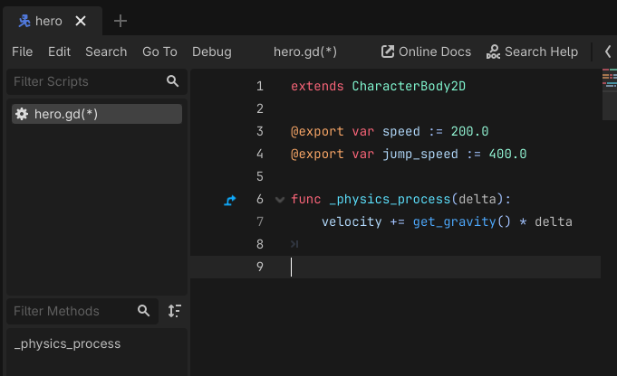
> *Tyngdekraften får Hero til at falde mod jorden.*

---

## ↔️ Trin 9: Bevæg Hero til siderne

Tilføj disse linjer inde i `_physics_process()`:

```gdscript
var direction := Input.get_axis("move_left", "move_right")
velocity.x = direction * speed
```

`Input.get_axis()` ser på de to actions:

```text
move_left
move_right
```

og giver en værdi, som fortæller, hvilken vej spilleren vil gå.

Det betyder for eksempel:

```text
venstre  → -1
ingen tast → 0
højre    → 1
```

Vi bruger kun `velocity.x`, fordi Hero kun skal styres vandret med tastaturet.

Tyngdekraft og hop styrer `velocity.y`.

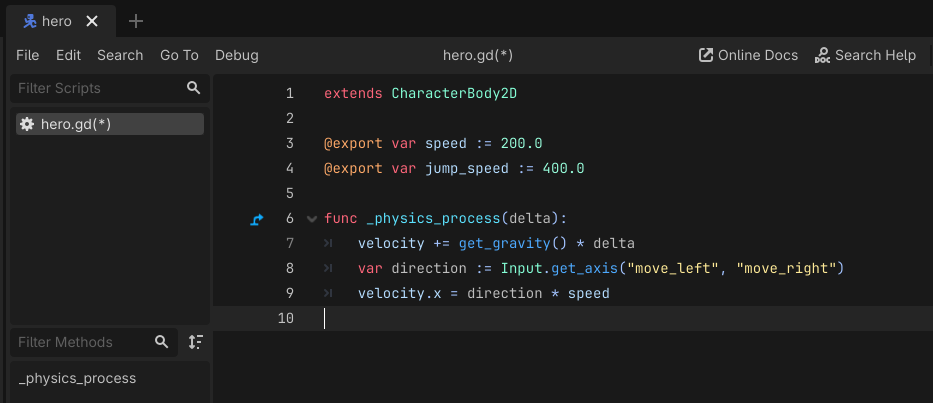
> *Input.get_axis() bruges til bevægelse til venstre og højre.*

---

## 🦘 Trin 10: Få Hero til at hoppe

Tilføj dette efter tyngdekraften:

```gdscript
if Input.is_action_just_pressed("jump") and is_on_floor():
    velocity.y = -jump_speed
```

Der sker to ting i `if`-linjen.

Godot kontrollerer:

1. om spilleren lige har trykket på `jump`
2. om Hero står på gulvet

Kun hvis begge dele er rigtige, hopper Hero.

`is_on_floor()` forhindrer Hero i bare at hoppe igen og igen midt i luften.

### Hvorfor står der minus foran jump_speed?

I Godots 2D-koordinater går Y-retningen nedad.

Derfor betyder:

```text
positiv Y → ned
negativ Y → op
```

Når vi skriver:

```gdscript
velocity.y = -jump_speed
```

bevæger Hero sig opad.

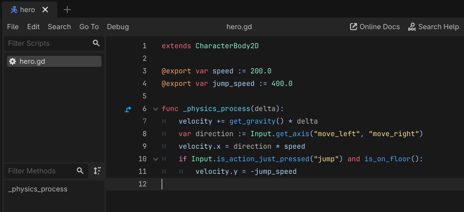
> *Hero må kun hoppe, når figuren står på gulvet.*

---

## 🚶 Trin 11: Flyt Hero

Tilføj til sidst:

```gdscript
move_and_slide()
```

Hele scriptet skal nu se sådan ud:

```gdscript
extends CharacterBody2D

@export var speed := 200.0
@export var jump_speed := 400.0

func _physics_process(delta):
	velocity += get_gravity() * delta
	var direction := Input.get_axis("move_left", "move_right")
	velocity.x = direction * speed
	if Input.is_action_just_pressed("jump") and is_on_floor():
		velocity.y = -jump_speed
	move_and_slide()
```

`move_and_slide()` flytter Hero ved hjælp af `velocity` og lader `CharacterBody2D` reagere på gulv, vægge og andre collision-former.

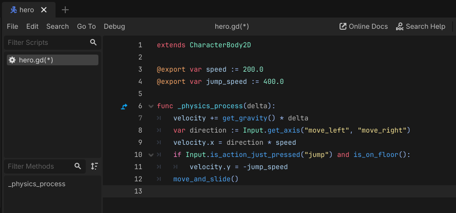
> *Det færdige script kombinerer tyngdekraft, hop og bevægelse til siderne.*

---

## 🧪 Trin 12: Lav en lille testscene

Til platformbevægelse skal Hero have et gulv at lande på.

Lav derfor en enkel testscene.

1. Opret en ny **2D Scene**.
2. Omdøb root-noden til:

```text
Test
```

3. Træk `hero.tscn` ind i scenen.
4. Tilføj en:

```text
StaticBody2D
```

5. Omdøb den til:

```text
Floor
```

6. Tilføj en `CollisionShape2D` som child til `Floor`.
7. Vælg:

```text
New RectangleShape2D
```

8. Gør collision-formen bred og flad.
9. Placer den under Hero.

Scene-træet kan se sådan ud:

```text
Test
├── Hero
└── Floor
    └── CollisionShape2D
```

Gem scenen som for eksempel:

```text
test.tscn
```

> **📌 Tip:**  
> Slå **Debug → Visible Collision Shapes** til, når du tester. Så kan du se det usynlige testgulv.

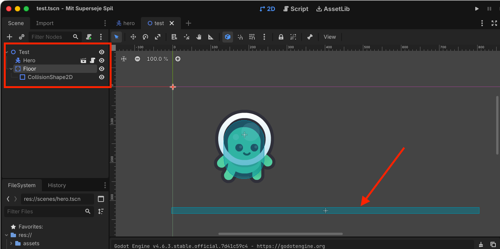
> *En StaticBody2D med collision kan bruges som et simpelt testgulv.*

---

## ▶️ Trin 13: Test bevægelsen

Kør den aktuelle scene ved at klikke på det lille film-ikon.

Kontroller først, at Hero:

1. falder ned mod gulvet
2. stopper, når figuren rammer gulvet
3. kan gå til venstre og højre
4. kan hoppe
5. lander igen efter hoppet

Prøv også at holde hop-tasten nede eller trykke flere gange i luften.

Hero skal **ikke** kunne hoppe igen, før figuren står på gulvet.

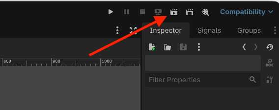
> *Hero kan nu gå, falde, hoppe og lande.*

---

## 🛠️ Trin 14: Tilpas bevægelsen

Hvis Hero går for hurtigt eller langsomt, kan du ændre:

```text
Speed
```

i Inspector.

Hvis hoppet er for lavt eller højt, kan du ændre:

```text
Jump Speed
```

Prøv for eksempel:

```text
Speed: 150
Jump Speed: 300
```

eller:

```text
Speed: 250
Jump Speed: 450
```

De rigtige værdier afhænger af størrelsen på din Hero og din bane.

> **📌 Tip:**  
> Start simpelt. Ting som dobbelt-hop, acceleration, wall-jump og coyote time kan tilføjes senere.

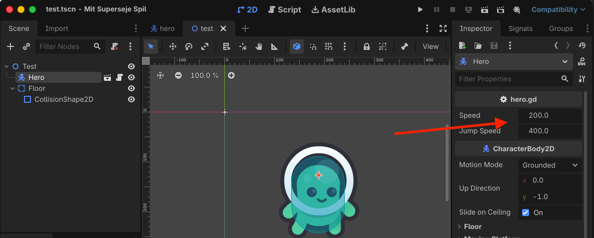
> *Du kan justere ganghastighed og hop uden at ændre koden.*

---

## 🔍 STOP OG TEST

Kontroller følgende:

- [ ] Hero bruger `CharacterBody2D`.
- [ ] Motion Mode er sat til `Grounded`.
- [ ] Jeg har lavet `move_left`, `move_right` og `jump` i Input Map.
- [ ] Hero har et `hero.gd`-script.
- [ ] Scriptet bruger `get_gravity()`.
- [ ] Scriptet bruger `Input.get_axis()`.
- [ ] Scriptet bruger `is_on_floor()` før et hop.
- [ ] Scriptet bruger `move_and_slide()`.
- [ ] Hero kan gå til venstre og højre.
- [ ] Hero falder nedad, når der ikke er et gulv.
- [ ] Hero kan hoppe fra gulvet.
- [ ] Hero kan ikke hoppe igen midt i luften.
- [ ] Hero lander på testgulvet.

---

## ❌ Hvis noget ikke virker

**Hero falder bare gennem gulvet**  
Kontroller, at både Hero og `Floor` har en `CollisionShape2D`, og at begge collision-former har en **Shape**.

**Hero falder ikke nedad**  
Kontroller, at scriptet indeholder:

```gdscript
velocity += get_gravity() * delta
```

**Hero kan gå, men ikke hoppe**  
Kontroller, at `jump` findes i **Input Map**, og at der er tilføjet en tast til actionen.

**Hero kan aldrig hoppe, selv om jump virker**  
Kontroller, at Motion Mode er `Grounded`. `is_on_floor()` skal kunne registrere testgulvet.

**Hero hopper nedad i stedet for opad**  
Kontroller, at der står minus foran `jump_speed`:

```gdscript
velocity.y = -jump_speed
```

**Hero kan hoppe midt i luften**  
Kontroller, at hop-koden også indeholder:

```gdscript
and is_on_floor()
```

**Hero bevæger sig den forkerte vej**  
Kontroller rækkefølgen i:

```gdscript
Input.get_axis("move_left", "move_right")
```

**Min animerede Hero viser kun idle-animationen**  
Det er helt fint i denne guide. Her laver du kun selve bevægelsen. Gang-, hop- og faldanimationer kan kobles på senere.

---

## 🎉 Færdig

Din Hero kan nu:

- gå til venstre og højre
- falde med tyngdekraften
- registrere gulvet
- hoppe
- lande på platforme
- bruge `move_and_slide()` til platformbevægelse

Du har nu den grundlæggende spillerstyring til et platformspil på plads.

Næste guide er:

**Sådan laver du et TileSet**
