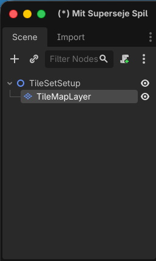
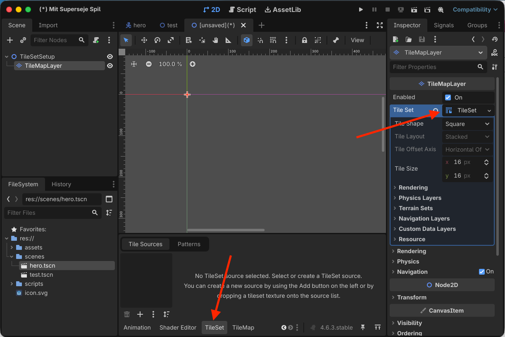
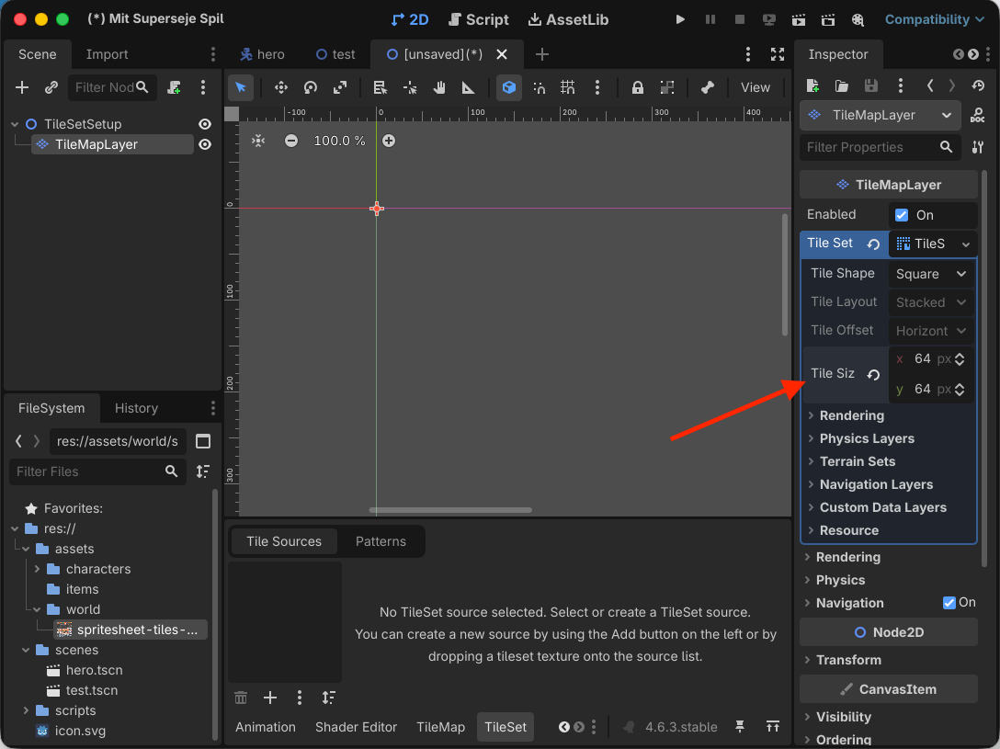
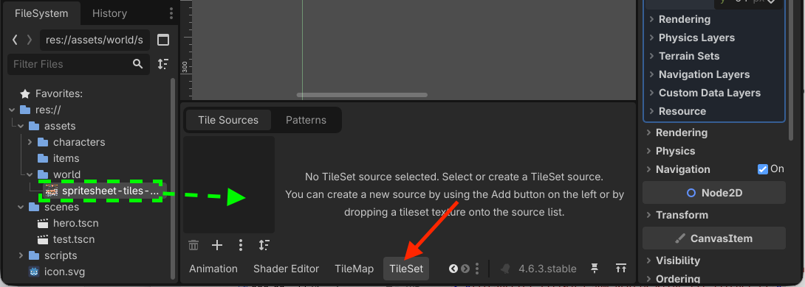
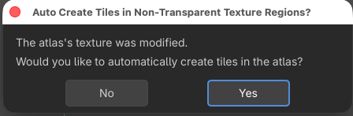
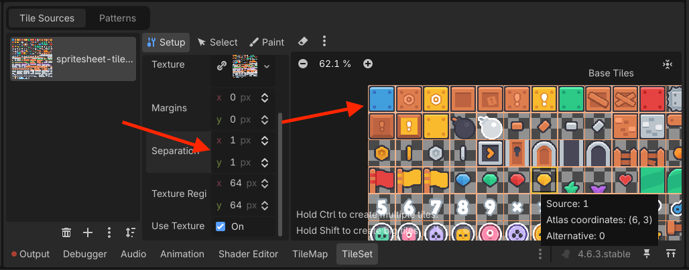
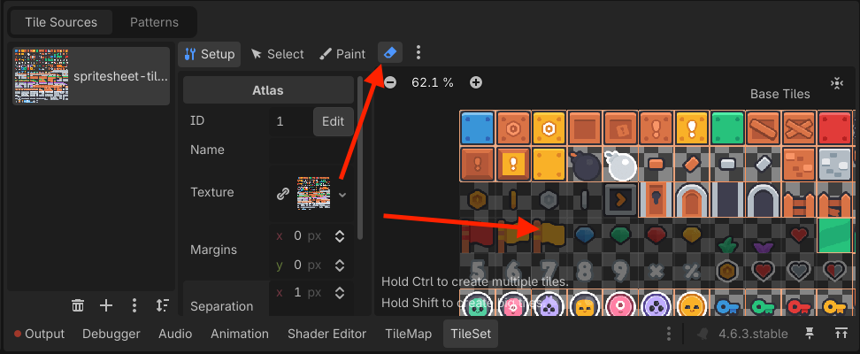
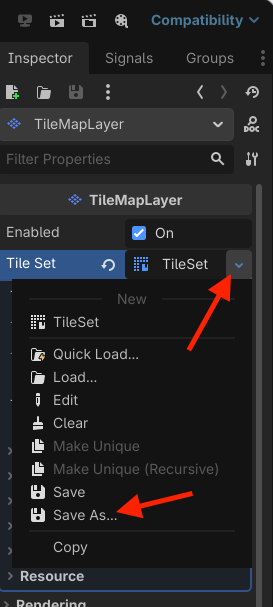
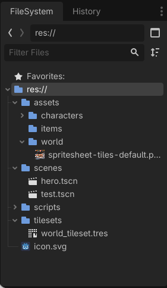
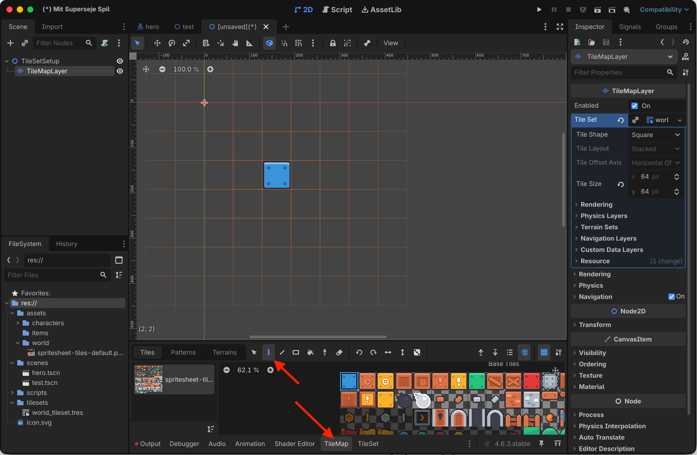

# Sådan laver du et TileSet

*Gør dit tilesheet til et genbrugeligt TileSet, som du senere kan bruge til at bygge baner.*

## 🎯 Målet med guiden

Når du er færdig, har du:

- oprettet et `TileMapLayer`
- lavet en ny `TileSet`-ressource
- indstillet den rigtige tile-størrelse
- tilføjet dit tilesheet til TileSet
- fået Godot til at dele tilesheetet op i enkelte tiles
- gemt dit TileSet, så det kan bruges i flere baner

Denne guide laver **ikke selve banen endnu**.

Det gør du i næste guide:

**Sådan bygger du en 2D-bane**

---

## 🧩 Før du går i gang

Du skal have et **tilesheet** i dit Godot-projekt.

Det kan for eksempel ligge her:

```text
res://assets/world/tilesheet.png
```

Du skal også kende størrelsen på de enkelte tiles.

Det kan for eksempel være:

```text
16 × 16
32 × 32
64 × 64
```

Hvis du ikke kender tile-størrelsen, så kig på informationen fra det asset pack, du har hentet.

> **📌 Vigtigt:**  
> Tile-størrelsen skal passe til grafikken. Ellers bliver tilesheetet delt forkert op.

---

## 🗺️ Trin 1: Opret en scene til at lave dit TileSet

Opret en ny **2D Scene** i Godot.

Omdøb root-noden til:

```text
TileSetSetup
```

Tilføj derefter en child-node:

```text
TileMapLayer
```

Scene-træet skal nu se sådan ud:

```text
TileSetSetup
└── TileMapLayer
```

`TileMapLayer` er den node, Godot bruger til at tegne en bane med tiles.

I denne guide bruger vi den først til at oprette selve TileSet'et.


> *Et TileMapLayer bruger et TileSet til at tegne tiles i en bane.*

---

## 🧱 Trin 2: Opret et nyt TileSet

Marker `TileMapLayer`.

Find feltet:

**Tile Set**

i **Inspector**.

Klik på feltet og vælg:

```text
New TileSet
```

Klik derefter på den nye `TileSet`-ressource, så dens indstillinger bliver synlige.


> *TileSet samler de tiles, vi senere kan male banen med.*

---

## 📐 Trin 3: Sæt den rigtige Tile Size

Inden du tilføjer dit tilesheet, skal du fortælle Godot, hvor store de enkelte tiles er.

Find:

**Tile Size**

på din `TileSet`-ressource.

Hvis dine tiles for eksempel er `32 × 32` pixels, skal du skrive:

```text
X: 32
Y: 32
```

Hvis de er `16 × 16`, skal du i stedet bruge:

```text
X: 16
Y: 16
```

Brug den størrelse, der passer til **dit eget tilesheet**.

> **⚠️ Vigtigt:**  
> Sæt **Tile Size før du tilføjer tilesheetet**. Så kan Godot automatisk dele billedet rigtigt op.


> *Tile Size skal passe til størrelsen på de enkelte felter i tilesheetet.*

---

## 🖼️ Trin 4: Tilføj dit tilesheet

Find dit tilesheet i **FileSystem**.

Det kan for eksempel hedde:

```text
tilesheet.png
```

Træk billedet fra **FileSystem** ned i **TileSet-panelet**.

Godot spørger, om der automatisk skal oprettes tiles ud fra billedet.

Vælg:

```text
Yes
```

Godot deler nu tilesheetet op ved hjælp af den **Tile Size**, du valgte før.


> *Tilesheetet tilføjes som grafik-kilde til TileSet'et.*


> *Godot kan automatisk oprette tiles ud fra felterne i tilesheetet.*

---

## 🔲 Trin 5: Kontroller at tilesheetet er delt rigtigt op

Se på tilesheetet i **TileSet-panelet**.

Hvert tile skal passe i sit eget felt.

Hvis dit tilesheet for eksempel består af `32 × 32` tiles, skal markeringerne følge det samme grid.

Du skal kunne vælge enkelte tiles uden samtidig at få dele af nabotiles med.

> Hvis det ikke ser helt rigtigt ud, så prøv at justere **Separation** som vist på billedet.


> *Hvert felt i grid'et skal passe til ét tile i grafikken.*

---

## 🧹 Trin 6: Fjern tiles, du ikke skal bruge

Nogle tilesheets indeholder felter, du ikke har brug for.

Det kan for eksempel være:

- tomme felter
- hjælpegrafik
- variationer, du ikke vil bruge
- grafik, der ikke hører til din bane

Du behøver ikke fjerne noget, hvis hele tilesheetet er brugbart.

Hvis du vil rydde op, kan du bruge **Eraser** i TileSet-editoren eller slette enkelte tiles.

> **📌 Tip:**  
> Start simpelt. Du behøver ikke gøre hele TileSet'et perfekt nu. Du kan altid ændre det senere.


> *Tiles, du ikke vil bruge, kan fjernes fra TileSet'et.*

---

## 💾 Trin 7: Gem dit TileSet som en fil

Det er en god idé at gemme TileSet'et som sin egen ressource.

Åbn menuen ved `TileSet`-ressourcen i **Inspector** og vælg at gemme ressourcen.

Gem den for eksempel som:

```text
res://tilesets/world_tileset.tres
```

Hvis mappen `tilesets` ikke findes endnu, kan du oprette den.

Din struktur kan for eksempel se sådan ud:

```text
res://
├── assets/
│   └── world/
│       └── tilesheet.png
└── tilesets/
    └── world_tileset.tres
```

Når TileSet'et ligger i sin egen `.tres`-fil, kan du bruge det igen i flere `TileMapLayer`-noder og flere baner.



> *TileSet'et er gemt som en genbrugelig ressource.*

---

## 👀 Trin 8: Kontroller at dine tiles er klar

Marker `TileMapLayer` igen.

Skift til den del af editoren, hvor du kan vælge tiles til dit `TileMapLayer`.

Du skal nu kunne se de enkelte tiles fra dit tilesheet og vælge dem én ad gangen.

Du behøver ikke bygge en rigtig bane endnu.

Det vigtigste er, at dine tiles er synlige og kan vælges.


> *TileSet'et er klar til at blive brugt til at bygge en bane.*

---

## 🚫 Vi laver ikke collision endnu

Et TileSet kan også indeholde collision, navigation og andre egenskaber.

Det springer vi over her.

I dette projekt laver vi vægge og collision som et **separat system**, så TileSet'et i første omgang kun skal bruges til grafikken i banen.

Du kommer til collision i en senere guide:

**Sådan laver du vægge, spilleren ikke kan gå igennem**

---

## 🔍 STOP OG TEST

Kontroller følgende:

- [ ] Jeg har et `TileMapLayer`.
- [ ] `TileMapLayer` har et `TileSet`.
- [ ] Jeg har sat den rigtige `Tile Size`.
- [ ] Mit tilesheet ligger i TileSet'et.
- [ ] Godot har delt tilesheetet op i enkelte tiles.
- [ ] De enkelte tiles passer til grid'et.
- [ ] Jeg kan vælge tiles én ad gangen.
- [ ] Mit TileSet er gemt som en `.tres`-fil.
- [ ] Jeg har ikke tilføjet collision til de enkelte tiles.

---

## ❌ Hvis noget ikke virker

**Hele tilesheetet bliver ét stort tile**  
Kontroller din **Tile Size**. Den skal passe til størrelsen på ét enkelt tile i billedet.

**Et tile indeholder dele af flere billeder**  
Din Tile Size er sandsynligvis forkert. Find den rigtige tile-størrelse fra dit asset pack og prøv igen.

**Grid'et ligger lidt forskudt i forhold til grafikken**  
Dit tilesheet kan have mellemrum eller en kant omkring tiles. Kig efter indstillinger som **Margins** og **Separation** på atlas-kilden.

**Jeg kan ikke se TileSet-panelet**  
Marker `TileMapLayer` og klik på dets `TileSet`-ressource igen.

**Nogle gennemsigtige felter mangler**  
Det er normalt, hvis Godot har oprettet tiles automatisk. Helt gennemsigtige områder bliver normalt ikke oprettet som tiles.

**Jeg kan ikke finde mit TileSet igen**  
Kontroller, at du har gemt ressourcen som for eksempel `world_tileset.tres`, og find den i **FileSystem**.

**Jeg kan gå igennem væggene, når jeg senere tester banen**  
Det er meningen på dette tidspunkt. Vi har endnu ikke lavet collision til banen.

---

## 🎉 Færdig

Du har nu et TileSet, der:

- bruger dit eget tilesheet
- kender størrelsen på dine tiles
- indeholder enkelte tiles, du kan vælge
- er gemt som en genbrugelig ressource

Nu er du klar til at bruge TileSet'et til at bygge selve banen.

Næste guide er:

**Sådan bygger du en 2D-bane**
