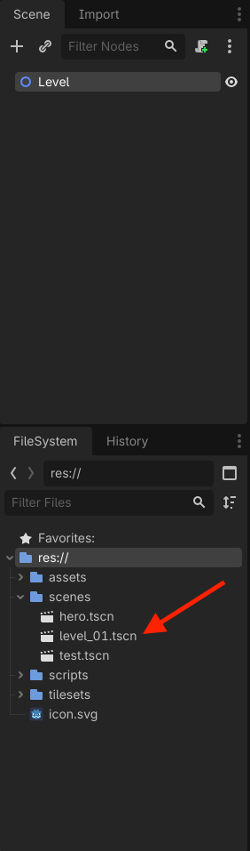
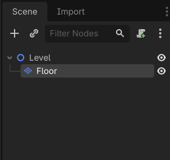
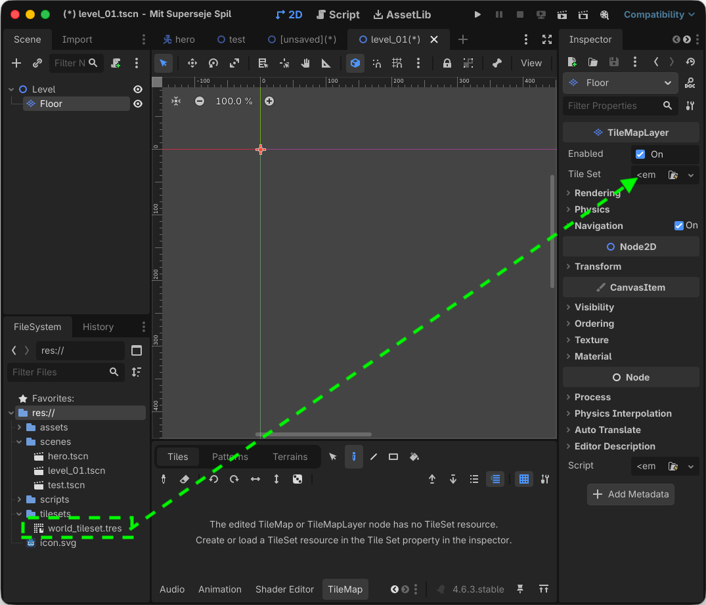
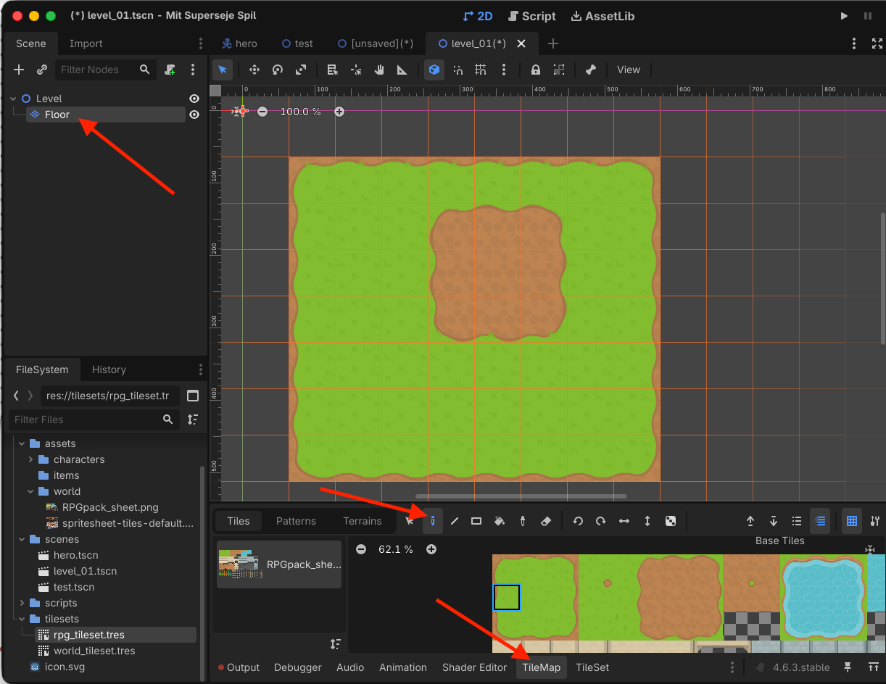
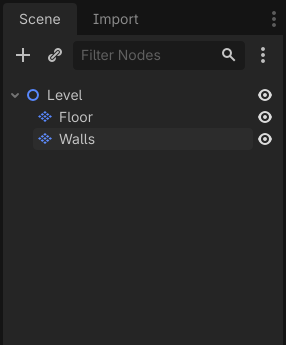
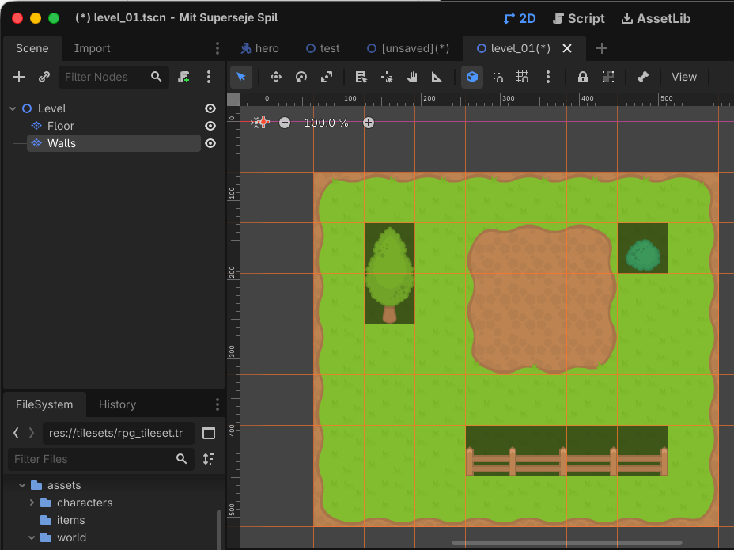
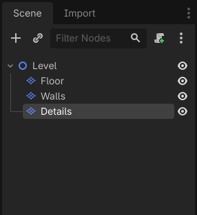
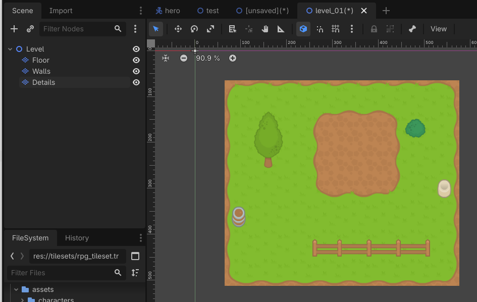
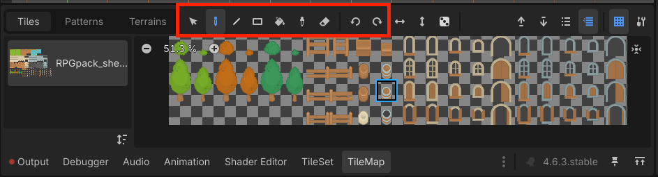
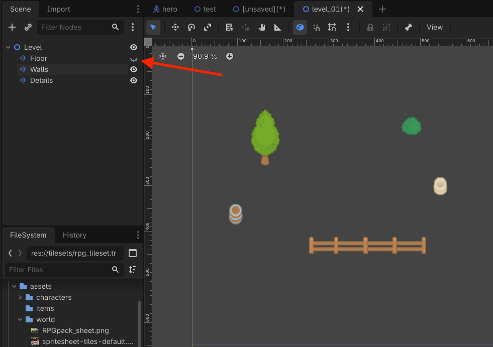

# Sådan bygger du en 2D-bane

*Brug dit TileSet til at male en bane med separate lag til gulv, vægge og detaljer.*

## 🎯 Målet med guiden

Når du er færdig, har du:

- oprettet en scene til din bane
- lavet separate `TileMapLayer`-noder til gulv, vægge og detaljer
- sat dit TileSet på alle lagene
- malet et gulv
- bygget banens vægge med tiles
- tilføjet lidt pynt og detaljer
- gemt banen som sin egen scene

Denne guide laver **kun banens grafik**.

Væggene kan derfor endnu ikke stoppe Hero.

Det laver du i næste guide:

**Sådan laver du vægge, spilleren ikke kan gå igennem**

---

## 🧩 Før du går i gang

Du skal have et færdigt `TileSet` fra den forrige guide.

Det kan for eksempel ligge her:

```text
res://tilesets/world_tileset.tres
```

TileSet'et skal indeholde de tiles, du vil bruge til din bane.

Det kan for eksempel være:

- gulv
- græs
- vægge
- stier
- vand
- træer
- sten
- anden pynt

> **📌 Tip:**  
> Du behøver ikke bruge alle tiles i dit TileSet. Start med en lille bane og få den til at fungere først.

---

## 🗺️ Trin 1: Opret en scene til banen

Opret en ny **2D Scene** i Godot.

Omdøb root-noden til:

```text
Level
```

Gem scenen med det samme som:

```text
res://scenes/level_01.tscn
```

Du kan vælge et andet navn, hvis du vil.


> *Banen får sin egen scene, så den kan gemmes og ændres separat.*

---

## 🟩 Trin 2: Lav et lag til gulvet

Marker `Level`.

Tilføj en child-node:

```text
TileMapLayer
```

Omdøb den til:

```text
Floor
```

Scene-træet skal nu se sådan ud:

```text
Level
└── Floor
```

`Floor` skal bruges til det nederste lag i banen.

Det kan for eksempel være:

- græs
- jord
- sten
- gulv
- sand


> *Floor er det nederste lag i banen.*

---

## 🧱 Trin 3: Sæt dit TileSet på Floor

Marker `Floor`.

Find feltet:

**Tile Set**

i **Inspector**.

Træk dit gemte TileSet fra **FileSystem** over på feltet.

Det kan for eksempel være:

```text
world_tileset.tres
```

Når TileSet'et er sat på, skal dine tiles kunne ses i **TileMap-panelet** nederst i Godot.


> *Floor bruger det TileSet, du lavede i den forrige guide.*

---

## 🎨 Trin 4: Mal gulvet

Marker `Floor` og åbn **TileMap-panelet** nederst i Godot.

Vælg et tile, der skal være banens grund.

Det kan for eksempel være:

```text
græs
```

eller:

```text
gulv
```

Mal derefter et område i 2D-vinduet.

Du kan male ved at:

- klikke for at placere ét tile
- holde venstre museknap nede og male flere tiles
- bruge **Rectangle** til et firkantet område
- bruge **Bucket Fill** til at fylde et område

Start med en forholdsvis lille bane.

> **📌 Tip:**  
> En lille bane er lettere at overskue, mens du lærer værktøjerne. Du kan altid gøre den større senere.


> *Gulvet males ved at placere tiles på grid'et.*

---

## 🧱 Trin 5: Lav et separat lag til vægge

Vi vil ikke blande væggene sammen med gulvet.

Lav et nyt **TileMapLayer** under **Level**

Omdøb den til:

```text
Walls
```

Træk igen dit tilesheet over i **Tile Set** ligesom du gjorde i trin 3.

Scene-træet skal nu se sådan ud:

```text
Level
├── Floor
└── Walls
```

Sørg for, at `Walls` ligger **under `Floor` i scene-træet**. Så bliver væg-grafikken tegnet oven på gulvet.


> *Gulv og vægge ligger på hvert sit lag, men bruger det samme TileSet.*

---

## 🧱 Trin 6: Mal banens vægge

Marker `Walls`.

Vælg de tiles, du vil bruge som vægge eller kanter.

Mal væggene rundt om de områder, spilleren senere skal kunne bevæge sig i.

Du kan for eksempel lave:

- en kant rundt om hele banen
- små rum
- gange
- forhindringer
- søer eller klipper, der senere skal blokere vejen

> **⚠️ Vigtigt:**  
> Væggene er kun **grafik** lige nu. Hero vil stadig kunne gå direkte igennem dem, indtil du laver collision i næste guide.

> **⚠️ Vigtigt:**  
> Felterne kan se "mørkere" ud mens du laver dine vægge. Det er fordi Godot viser dig hvilke tiles, der hører til det TilemapLayer du er i gang med.


> *Walls-laget viser, hvor banens vægge, planter osv. skal være.*

---

## 🌿 Trin 7: Lav et lag til detaljer

Tilføj endnu et `TileMapLayer` på samme måde, som da du tilføjede `Walls`.

Omdøb laget til:

```text
Details
```

Scene-træet skal nu se sådan ud:

```text
Level
├── Floor
├── Walls
└── Details
```

`Details` kan bruges til grafik, der gør banen mindre tom.

Det kan for eksempel være:

- blomster
- små sten
- revner i gulvet
- blade
- tæpper
- andre små dekorationer


> *Separate lag gør banen lettere at bygge og ændre.*

---

## ✨ Trin 8: Tilføj lidt pynt

Marker `Details`.

Vælg nogle dekorative tiles og placer dem rundt omkring på banen.

Prøv ikke at fylde alle tomme felter.

Lidt variation er ofte nok til at gøre banen mere interessant.

Du kan også bruge flere forskellige gulv- eller detaljetiles, hvis dit TileSet indeholder variationer.

> **📌 Tip:**  
> Hold de vigtigste områder tydelige. Spilleren skal stadig kunne se, hvor man kan gå, og hvor væggene er.


> *Detaljer kan gøre banen mere levende uden at ændre dens grundform.*

---

## 🧹 Trin 9: Ret fejl med Eraser og Picker

Det er helt normalt at placere et forkert tile.

I **TileMap-panelet** kan du bruge værktøjer til hurtigt at rette banen.

### Eraser

Brug **Eraser** til at fjerne tiles, du har placeret forkert.

Du kan også højreklikke, mens du maler, for at fjerne tiles.

### Picker

Brug **Picker** til at vælge et tile, der allerede ligger i banen.

Det er praktisk, hvis du kan se det tile, du vil bruge, men ikke kan finde det i TileMap-panelet.


> *Eraser og Picker gør det hurtigt at rette og fortsætte på banen.*

---

## 👀 Trin 10: Kontroller dine lag

Se på scene-træet.

Det skal nogenlunde se sådan ud:

```text
Level
├── Floor
├── Walls
└── Details
```

Prøv at slå synligheden fra og til på de enkelte lag med øje-ikonet i scene-træet.

Når du skjuler `Floor`, skal gulvet forsvinde.

Når du skjuler `Walls`, skal væggene forsvinde.

Når du skjuler `Details`, skal pynten forsvinde.

Så ved du, at du ikke ved en fejl har malet alt på samme lag.


> *Du kan skjule lagene enkeltvis for at kontrollere, hvad der ligger hvor.*

---

## 💾 Trin 11: Gem banen

Gem scenen igen med:

```text
Ctrl + S
```

Din projektstruktur kan nu for eksempel se sådan ud:

```text
res://
├── assets/
│   └── world/
│       └── tilesheet.png
├── scenes/
│   ├── hero.tscn
│   └── level_01.tscn
└── tilesets/
    └── world_tileset.tres
```

---

## 🚫 Vi laver ikke collision endnu

Selvom væggene ser solide ud, er de endnu kun billeder.

Hvis du satte Hero ind i banen nu, ville Hero kunne gå igennem dem.

Det er helt meningen.

I næste guide laver du et separat collision-system oven på banen.

På den måde kan du ændre grafikken uden at skulle bygge physics shapes ind i hvert enkelt tile.

---

## 🔍 STOP OG TEST

Kontroller følgende:

- [ ] Jeg har en scene med root-noden `Level`.
- [ ] Jeg har et `TileMapLayer` med navnet `Floor`.
- [ ] Jeg har et `TileMapLayer` med navnet `Walls`.
- [ ] Jeg har et `TileMapLayer` med navnet `Details`.
- [ ] Alle tre lag bruger mit TileSet.
- [ ] Jeg har malet et sammenhængende gulv.
- [ ] Jeg har placeret vægge eller kanter på `Walls`-laget.
- [ ] Jeg har lagt lidt pynt på `Details`-laget.
- [ ] Jeg kan skjule lagene enkeltvis og se forskellen.
- [ ] Banen er gemt som sin egen `.tscn`-fil.
- [ ] Jeg har ikke lavet collision endnu.

---

## ❌ Hvis noget ikke virker

**Jeg kan ikke se mine tiles nederst i Godot**  
Kontroller, at dit `TileMapLayer` har det rigtige `TileSet` i feltet **Tile Set**.

**Jeg maler, men der kommer ingen tiles i 2D-vinduet**  
Kontroller, at du har valgt et tile i **TileMap-panelet**, og at det rigtige `TileMapLayer` er markeret.

**Jeg kom til at male vægge på Floor**  
Fjern dem fra `Floor` med Eraser, vælg `Walls`, og mal dem igen dér.

**Mine vægge ligger bag gulvet**  
Kontroller rækkefølgen i scene-træet. `Floor` skal ligge over `Walls`, så `Walls` bliver tegnet oven på gulvet.

**Mine detaljer ligger bag væggene**  
Sørg for, at `Details` ligger under `Walls` i scene-træet.

**Jeg kan ikke finde det tile, jeg brugte før**  
Brug **Picker** på et tile, der allerede ligger i banen.

**Banen er blevet alt for stor**  
Slet noget af den igen, eller start med et mindre område. Det er lettere at arbejde med en lille bane først.

**Hero kan gå igennem væggene**  
Det er meningen på dette tidspunkt. Denne guide laver kun banens grafik. Collision kommer i næste guide.

---

## 🎉 Færdig

Du har nu en 2D-bane med:

- et gulvlag
- et væglag
- et lag til detaljer
- et genbrugeligt TileSet
- en scene, du kan bygge videre på

Banen har endnu ikke fysiske vægge.

Det laver du i næste guide:

**Sådan laver du vægge, spilleren ikke kan gå igennem**
