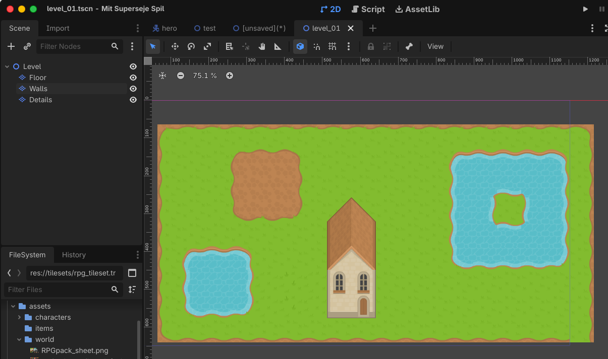
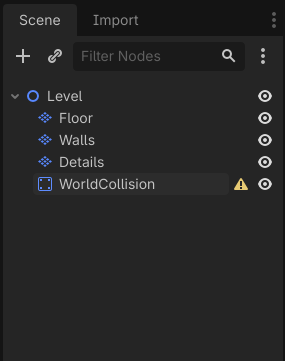
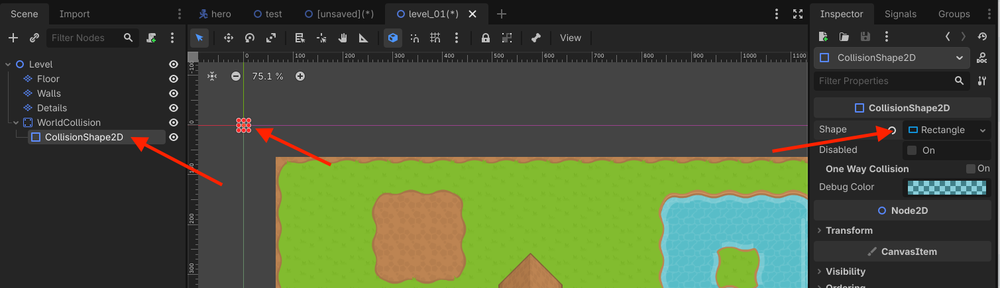
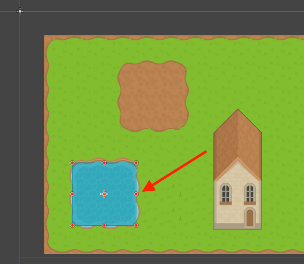
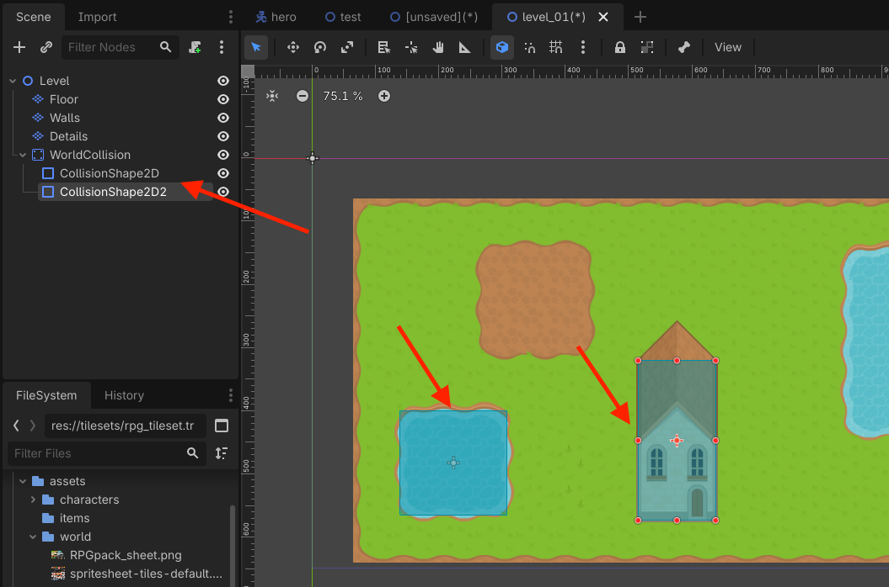
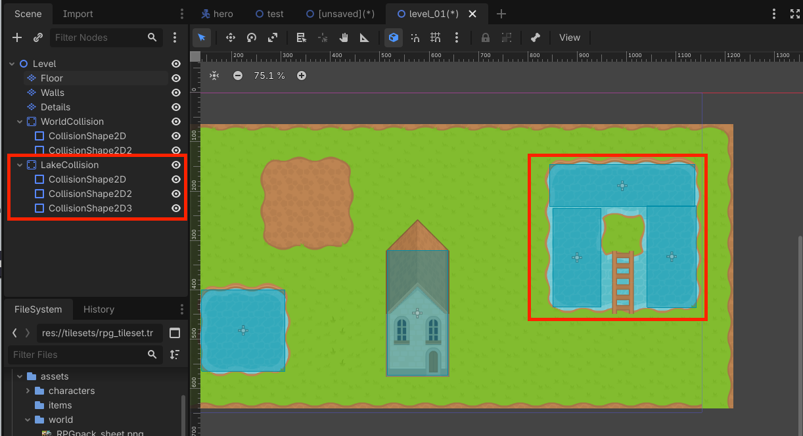
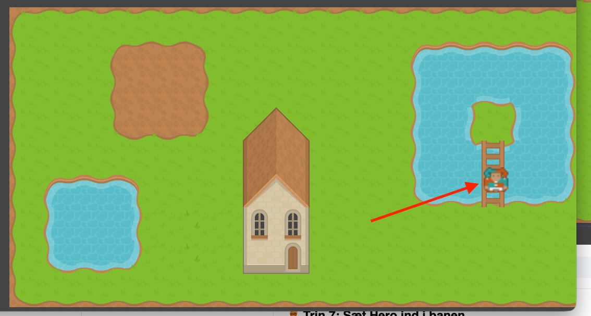
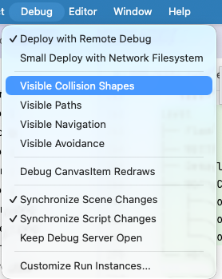
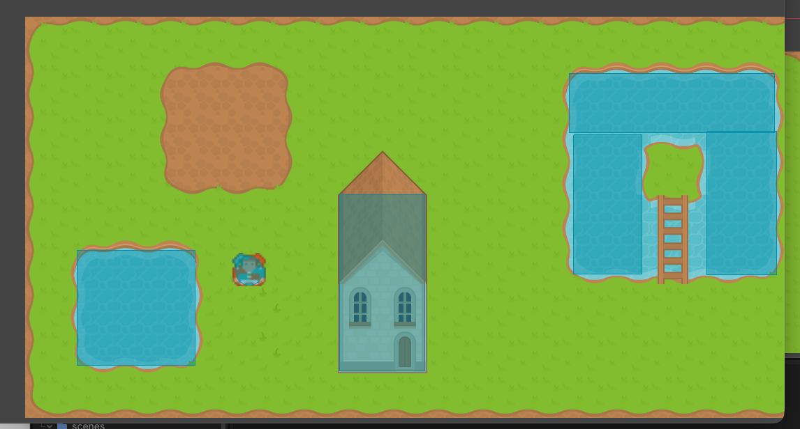

# Sådan laver du vægge, spilleren ikke kan gå igennem

*Læg collision oven på din bane, så Hero bliver stoppet af vægge og andre solide områder.*

## 🎯 Målet med guiden

Når du er færdig, har du:

- tilføjet et separat collision-system til banen
- lavet en `StaticBody2D` til banens faste vægge
- tilføjet flere `CollisionShape2D`-former
- placeret collision oven på væggene i banen
- sat Hero ind i banen
- testet, at Hero ikke længere kan gå gennem væggene

I denne guide bygger vi collision **oven på banen**.

Vi ændrer altså ikke de enkelte tiles i dit TileSet.

Det betyder, at banens grafik og banens collision kan ændres hver for sig.

> **📌 Platformspil:**  
> Guiden tager udgangspunkt i væggene fra top-down-banen i guide 7. I et platformspil kan du bruge samme metode til gulve, vægge og platforme.

---

## 🧩 Før du går i gang

Du skal have en bane fra den forrige guide.

Scene-træet kan for eksempel se sådan ud:

```text
Level
├── Floor
├── Walls
└── Details
```

Du skal også have en Hero, der:

- er en `CharacterBody2D`
- har en `CollisionShape2D`
- bruger `move_and_slide()` til bevægelse

Banens vægge er stadig kun grafik.

Nu skal vi lægge usynlige collision-former oven på dem.

---

## 🧱 Trin 1: Åbn din bane

Find din banescene i **FileSystem**.

Den kan for eksempel hedde:

```text
level_01.tscn
```

Åbn scenen.

Kontroller, at du kan se dine lag med gulv, vægge og detaljer.


> *Vi tager udgangspunkt i banen, der allerede er bygget med tiles.*

---

## 🧱 Trin 2: Tilføj WorldCollision

Marker `Level`.

Tilføj en child-node:

```text
StaticBody2D
```

Omdøb den til:

```text
WorldCollision
```

Scene-træet skal nu se sådan ud:

```text
Level
├── Floor
├── Walls
├── Details
└── WorldCollision
```

`StaticBody2D` passer godt til ting, der skal stå stille i spillet.

Det kan for eksempel være:

- vægge
- gulve
- klipper
- bygninger
- faste forhindringer

`WorldCollision` bliver vores samlede fysiske bane.


> *WorldCollision holder styr på de områder, Hero ikke må gå igennem.*

---

## 🔲 Trin 3: Tilføj den første collision-form

Marker `WorldCollision`.

Tilføj en child-node:

```text
CollisionShape2D
```

Scene-træet skal nu se sådan ud:

```text
Level
├── Floor
├── Walls
├── Details
└── WorldCollision
    └── CollisionShape2D
```

Marker `CollisionShape2D`.

Find feltet:

**Shape**

i **Inspector**.

Vælg:

```text
New RectangleShape2D
```

Der vises nu en rektangulær collision-form i 2D-vinduet.

> Læg mærke til at den nye collision-form godt kan ligge lidt uden for din bane, ligesom på billedet nedenfor.


> *En RectangleShape2D kan bruges som usynlig fysisk væg.*

---

## 📏 Trin 4: Placér collision oven på en væg

Flyt `CollisionShape2D` hen over en af væggene i banen. På billedet kan man se, at collision-formen er brugt til at stoppe Hero fra at gå ud i vandet.

Brug håndtagene på formen til at ændre dens størrelse, så den dækker væggen.

Hvis du for eksempel har en lang væg langs toppen af banen, kan collision-formen være et langt, smalt rektangel.

Collision behøver ikke følge hver eneste pixel i grafikken.

Det vigtigste er, at den passer til det område, spilleren skal opleve som solidt.

> **📌 Tip:**  
> Lav hellere en enkel collision-form end en meget detaljeret form. Det er lettere at arbejde med og føles ofte bedre i spillet.


> *Collision-formen lægges oven på det område, Hero ikke må gå igennem.*

---

## ➕ Trin 5: Lav collision til flere vægge

Du behøver ikke oprette en ny `StaticBody2D` for hver væg.

`WorldCollision` kan have flere `CollisionShape2D`-børn.

Du kan derfor duplikere den første `CollisionShape2D` og flytte kopien til en ny væg.

Gentag, indtil de vigtigste vægge har collision.

Scene-træet kan for eksempel se sådan ud:

```text
Level
├── Floor
├── Walls
├── Details
└── WorldCollision
    ├── CollisionShape2D
    ├── CollisionShape2D2
    ├── CollisionShape2D3
    └── CollisionShape2D4
```

Du kan også omdøbe dem, hvis det gør banen lettere at forstå.

For eksempel:

```text
TopWall
BottomWall
LeftWall
RightWall
```


> *Én StaticBody2D kan have flere collision-former.*

---

## 🧩 Trin 6: Del komplicerede vægge op

Nogle vægge er ikke bare ét langt rektangel.

De kan for eksempel:

- dreje rundt om et hjørne
- have en åbning til en dør
- danne et lille rum
- bestå af flere separate klipper
- Afgrænse en sø med ø og bro som herunder

Her kan du bruge flere mindre `CollisionShape2D`-former.

For eksempel kan en L-formet væg laves med to rektangler:

I stedet for at forsøge at lave én meget kompliceret form, kan du lægge ét rektangel på den vandrette del og ét på den lodrette del.

Det er også helt i orden, hvis collision-formerne overlapper lidt.


> *Komplicerede vægge kan bygges af flere simple collision-former.*

---

## 🦸 Trin 7: Sæt Hero ind i banen

Nu skal vi teste collision.

Find:

```text
hero.tscn
```

i **FileSystem**.

Træk Hero ind i `Level`-scenen.

Placér Hero på et sted med gulv og lidt afstand til væggene.

Scene-træet kan nu se sådan ud:

```text
Level
├── Floor
├── Walls
├── Details
├── WorldCollision
│   ├── CollisionShape2D
│   ├── CollisionShape2D2
│   └── CollisionShape2D3
└── Hero
```

 
> *Hero sættes ind i banen, så vi kan teste de fysiske vægge.*

---

## 🟦 Trin 8: Vis collision-formerne under testen

Godot kan vise collision-formerne, mens spillet kører.

Åbn menuen:

```text
Debug
```

Slå:

```text
Visible Collision Shapes
```

til.

Når du kører spillet, kan du nu se de usynlige collision-former oven på banen.

Det gør det meget lettere at opdage:

- huller mellem collision-former
- former der er for store
- former der ligger forkert


> *Visible Collision Shapes gør de usynlige fysiske former synlige under testen.*

---

## ▶️ Trin 9: Test væggene

Kør banen.

Bevæg Hero hen imod en væg.

Hero skal stoppe ved collision-formen i stedet for at gå gennem væggen.

Prøv også at gå langs væggen.

Når Hero bruger `move_and_slide()`, skal figuren kunne glide langs væggen i stedet for at sidde fast med det samme.

Test flere steder i banen.

Prøv især:

- hjørner
- smalle gange
- åbninger
- steder hvor to collision-former mødes


> *Hero bliver nu stoppet af banens collision.*

---

## 🔧 Trin 10: Justér collision efter testen

Det er normalt, at collision ikke passer perfekt første gang.

Stop spillet og ret formerne.

Hvis Hero bliver stoppet **for langt fra væggen**, skal collision-formen gøres mindre eller flyttes tættere på grafikken.

Hvis Hero kan gå **for langt ind i væggen**, skal formen gøres større eller flyttes ud.

Hvis Hero kan smutte gennem et hjørne, kan der være et lille hul mellem to former.

Flyt eller forlæng dem en smule, så hullet lukkes.

> **📌 Tip:**  
> Collision behøver ikke være perfekt. Den skal først og fremmest få bevægelsen til at føles rigtig.

---

## 💾 Trin 11: Gem banen

Når væggene fungerer, skal du gemme scenen igen.

Tryk:

```text
Ctrl + S
```

Collision ligger nu sammen med banen i `level_01.tscn`, men er stadig adskilt fra selve TileSet'et.

Det betyder, at du senere kan:

- ændre væg-grafikken
- flytte tiles
- ændre collision-formerne
- tilføje nye forhindringer

uden at skulle redigere physics shapes på hvert enkelt tile.

---

## 🧠 Hvorfor laver vi collision separat?

I Godot kan man også bygge collision direkte ind i et TileSet.

I dette projekt vælger vi i stedet at holde de to ting adskilt:

```text
TileMapLayer = grafik
StaticBody2D = collision
```

Det gør det tydeligt, hvad der styrer udseendet, og hvad der styrer fysikken.

Det er især praktisk i små projekter, hvor du hurtigt vil kunne flytte og tilpasse vægge uden at redigere TileSet'et.

---

## 🔍 STOP OG TEST

Kontroller følgende:

- [ ] Min bane har en `StaticBody2D` med navnet `WorldCollision`.
- [ ] `WorldCollision` har mindst én `CollisionShape2D`.
- [ ] Hver `CollisionShape2D` har en Shape.
- [ ] Mine collision-former ligger oven på de vægge, der skal være solide.
- [ ] Jeg har ikke tilføjet collision til de enkelte tiles i TileSet'et.
- [ ] Hero er placeret i banen.
- [ ] Hero har sin egen `CollisionShape2D`.
- [ ] Jeg kan køre banen og styre Hero.
- [ ] Hero bliver stoppet af væggene.
- [ ] Hero kan bevæge sig langs væggene.
- [ ] Jeg har testet hjørner og åbninger.
- [ ] Banen er gemt.

---

## ❌ Hvis noget ikke virker

**Hero går stadig lige gennem væggen**  
Kontroller, at collision-formen er child direkte under `WorldCollision`, og at `WorldCollision` er en `StaticBody2D`.

Kontroller også, at Hero selv har en `CollisionShape2D` og bruger `move_and_slide()`.

**Der står en advarsel ved CollisionShape2D**  
Kontroller, at du har valgt en Shape, for eksempel `RectangleShape2D`.

**Hero bliver stoppet, selvom der ikke ser ud til at være en væg**  
Slå **Visible Collision Shapes** til og se, om en collision-form er for stor eller ligger forkert.

**Hero kan gå gennem et lille hul mellem to vægge**  
Flyt eller forlæng collision-formerne en smule, så der ikke er et hul mellem dem.

**Hero sidder fast i et hjørne**  
Prøv at gøre collision-formerne lidt enklere og kontroller, at de ikke skaber små ujævne kanter.

**Min collision flytter sig mærkeligt, når jeg ændrer størrelsen**  
Kontroller, at du ændrer selve Shape-formens størrelse og ikke `Scale` på noden.

**Collision virker nogle steder, men ikke andre**  
Brug **Visible Collision Shapes** og kontroller, at alle de nødvendige vægge faktisk har en collision-form.

**Collision-formerne ser rigtige ud, men Hero går stadig igennem dem**  
Hvis du tidligere har ændret **Collision Layer** eller **Collision Mask**, skal du kontrollere, at Hero og `WorldCollision` er sat til lag, der kan kollidere med hinanden. Standardindstillingerne virker normalt uden ændringer.

---

## 🎉 Færdig

Din bane har nu:

- grafik lavet med `TileMapLayer`
- et separat `WorldCollision`
- fysiske vægge med `CollisionShape2D`
- en Hero, der ikke længere kan gå gennem væggene

Grafik og collision er stadig to separate systemer, så du kan ændre dem uafhængigt af hinanden.

Næste guide er:

**Sådan får du kameraet til at følge Hero**
