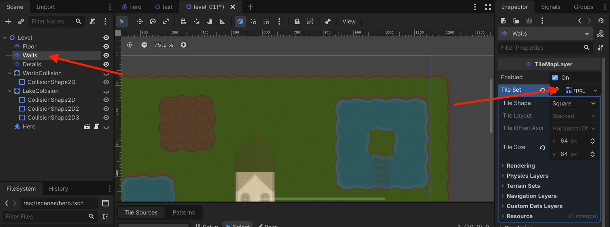
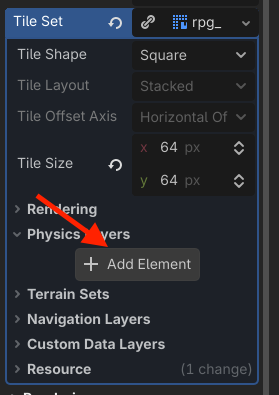
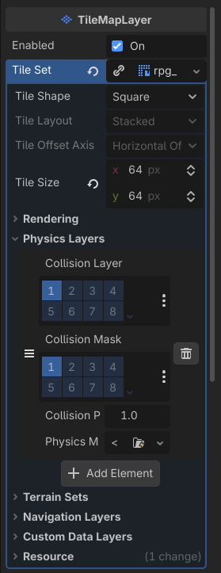
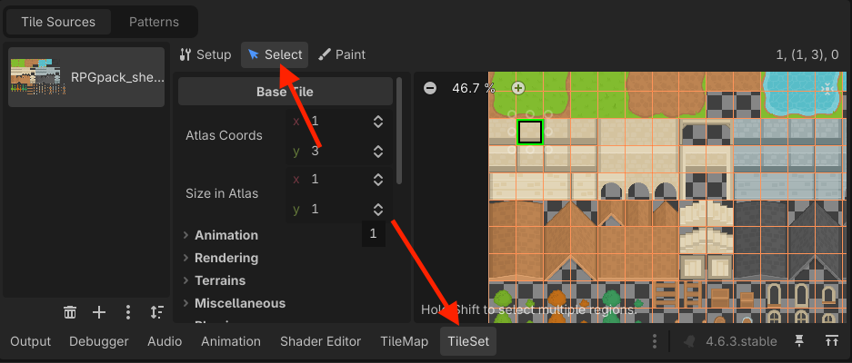
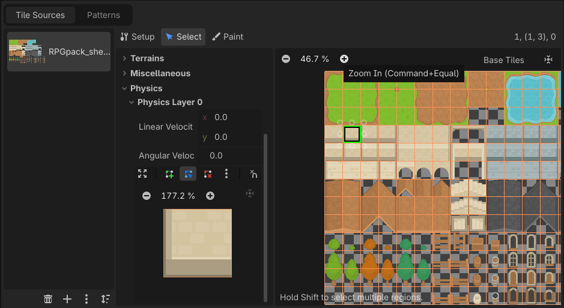
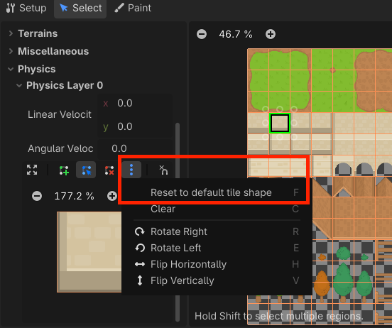
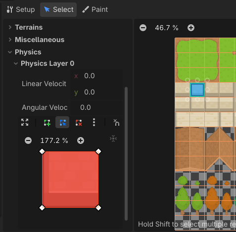
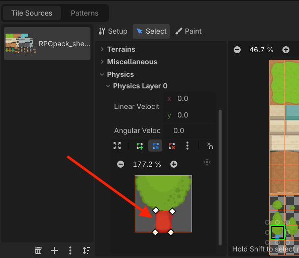
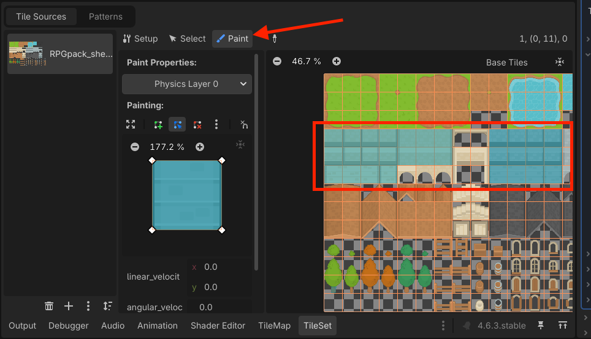
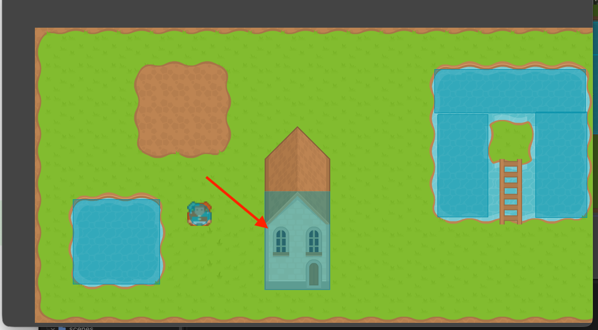

# Sådan bygger du collision ind i dit TileSet

*Giv dine tiles deres egen collision, så vægge og platforme automatisk bliver solide, når du maler dem i banen.*

## 🎯 Målet med guiden

Når du er færdig, har du:

- tilføjet en **Physics Layer** til dit `TileSet`
- lavet collision på de tiles, der skal være solide
- testet collision direkte i din bane
- set collision-formerne med **Visible Collision Shapes**
- lært, hvordan collision følger med et tile, hver gang det bliver brugt

Denne guide er et **alternativ til guide 8**.

I guide 8 laver du collision som separate `StaticBody2D`-former oven på banen.

I denne guide bygger du i stedet collision direkte ind i dit `TileSet`.

> **📌 Man må gerne blande metoderne:**  
> Du behøver ikke både collision i TileSet'et og et separat `WorldCollision` oven på de samme vægge. Men du må gerne have `WorldCollision` på fx en sø og bruge TileSet collision til væggene i et hus. Denne guide viser dig hvordan.

---

## 🧠 Hvad er forskellen?

Når collision ligger i TileSet'et, bliver collision en del af selve tile-definitionen.

Det betyder:

```text
Væg-tile + collision
```

Hver gang du maler det væg-tile i en `TileMapLayer`, følger collision automatisk med.

Det er praktisk, når du bruger de samme væg- eller platformtiles mange gange, som hvis du fx vil lave mange huse i et level, eller mange ens platforme.

Ingen af metoderne er den eneste rigtige.

De passer bare til forskellige måder at bygge baner på.

---

## 🧩 Før du går i gang

Du skal have:

- et færdigt `TileSet`
- en bane bygget med `TileMapLayer`
- en Hero med `CollisionShape2D`
- bevægelse med `move_and_slide()`

Dit TileSet kan for eksempel ligge her:

```text
res://tilesets/world_tileset.tres
```

Din bane kan for eksempel have:

```text
Level
├── Floor
├── Walls
└── Details
```

---

## 🧱 Trin 1: Åbn banen og vælg et TileMapLayer

Åbn din banescene.

Marker det `TileMapLayer`, der bruger det TileSet, du vil redigere.

Det kan for eksempel være:

```text
Walls
```

Find feltet:

**Tile Set**

i **Inspector**.

Klik på TileSet-ressourcen, så dens indstillinger bliver synlige.


> *Vi redigerer det samme TileSet, som banen allerede bruger.*

---

## ⚙️ Trin 2: Tilføj en Physics Layer

Find sektionen:

```text
Physics Layers
```

på TileSet-ressourcen.

Klik:

```text
Add Element
```

Godot opretter nu en physics layer.

Den første vil typisk være:

```text
Physics Layer 0
```

Denne layer fortæller TileSet'et, at tiles kan få fysiske collision-former.



> *En Physics Layer gør det muligt at give de enkelte tiles collision.*

---

## 🎨 Trin 3: Åbn TileSet-editoren

Åbn **TileSet-panelet** nederst i Godot.

Skift til:

```text
Select
```

Nu kan du klikke på ét tile og redigere dets egenskaber.


> *I Select-mode kan vi redigere egenskaberne på et bestemt tile.*

---

## 🧱 Trin 4: Vælg et tile, der skal være solidt

Klik på et tile, der bruges som væg, klippe, platform eller anden fast forhindring.

Vælg et tile, som Hero **ikke** skal kunne gå igennem.

Når tile'et er valgt, skal du kunne finde en sektion til den physics layer, du lige har lavet.

Den kan for eksempel hedde:

```text
Physics Layer 0
```

Her kan du tegne tile'ets collision-form.


> *Vi giver kun collision til tiles, der skal være solide.*

---

## 🔲 Trin 5: Lav en rektangulær collision-form

Til mange almindelige væg- og platformtiles kan du starte med et rektangel.

Når collision-editoren er aktiv, kan du bruge genvejen:

```text
F
```

Godot laver en rektangulær collision-form, der fylder tile'et.

Hvis genvejen ikke reagerer, så klik først inde i collision-editoren og prøv igen.




> *Et helt solidt tile kan ofte bruge en simpel rektangulær collision-form.*

---

## ✏️ Trin 6: Tilpas formen til grafikken

Collision behøver ikke altid fylde hele tile'et.

Du kan flytte punkterne i polygonen, så formen passer bedre til det område, der skal være solidt.

Det kan for eksempel være nyttigt til:

- en klippe med ujævne kanter
- en skrå platform
- et træ, hvor kun stammen skal blokere
- en væg, hvor Hero gerne må komme lidt tættere på grafikken

Hold formen så enkel som muligt.

> **📌 Tip:**  
> Collision skal først og fremmest føles rigtig at spille med. Den behøver ikke følge hver pixel i billedet.


> *Collision-formen kan tilpasses det område af tile'et, der skal være solidt. Her er det fx kun stammen man ikke kan gå igennem*

---

## 🪜 Trin 7: Lav collision på de andre solide tiles

Gentag processen på de andre tiles, Hero ikke skal kunne gå igennem.

Det kan for eksempel være:

- vægge
- klipper
- vandkanter
- platforme
- gulv i et platformspil

Lad tiles uden fysisk betydning være uden collision.

Det gælder typisk ting som:

- blomster
- gulv i et top-down-spil
- små dekorationer
- revner og mønstre

---

## 🖌️ Trin 8: Genbrug den samme collision-form

Hvis mange tiles skal have den samme collision-form, behøver du ikke nødvendigvis tegne den igen fra bunden hver gang.

TileSet-editoren har værktøjer til at arbejde med egenskaber på flere tiles.

Du kan for eksempel bruge **property painting** til at male den samme collision-egenskab på flere tiles.

Det er især praktisk, hvis mange tiles bare skal være helt solide firkanter.

> **📌 Tip:**  
> Start gerne med at lave nogle få tiles én ad gangen. Brug først genvejene, når du har forstået, hvordan collision på ét tile fungerer.


> *Den samme collision kan hurtigt genbruges på flere tiles. Her har jeg valgt en masse tiles der alle skal have collision. på hele tilen*

---

## 💾 Trin 9: Gem TileSet'et

Gem projektet med:

```text
Ctrl + S
```

Hvis TileSet'et er gemt som sin egen `.tres`-fil, bliver ændringerne gemt i den ressource.

For eksempel:

```text
res://tilesets/world_tileset.tres
```

Det betyder også, at andre `TileMapLayer`-noder, der bruger det samme TileSet, får de samme tile-egenskaber.

> **📌 Husk:**  
> Collision hører nu til tile'et. Hvis det samme væg-tile bruges 50 steder i banen, har alle 50 steder collision.

---

## 🦸 Trin 10: Sæt Hero ind i banen

Hvis Hero ikke allerede ligger i banen, så find:

```text
hero.tscn
```

i **FileSystem** og træk den ind i `Level`.

Placér Hero et sted, hvor den ikke starter oven i en solid væg.

Scene-træet kan for eksempel se sådan ud:

```text
Level
├── Floor
├── Walls
├── Details
└── Hero
```

Du behøver **ikke** tilføje en `StaticBody2D` til banen i denne version.

Collision kommer fra de tiles, du lige har redigeret.

---

## 👀 Trin 11: Vis collision under testen

Åbn menuen:

```text
Debug
```

Slå:

```text
Visible Collision Shapes
```

til.

Kør banen.

Du skal nu kunne se collision-formerne på de tiles, du har gjort solide.

Det er en god måde at kontrollere, om du har:

- glemt collision på et tile
- givet collision til et forkert tile
- lavet en form, der er for stor
- lavet en form, der er for lille



> *Collision-formerne følger automatisk de tiles, der bruger dem. Den markerede collision shape kommer fra vores tile set. De andre kommer fra `WallCollision`*

---

## ▶️ Trin 12: Test banen

Bevæg Hero hen mod de solide tiles.

Hero skal blive stoppet.

Test flere forskellige tiles.

Prøv især:

- lange vægge
- hjørner
- åbninger
- forskellige vægtyper
- skrå former, hvis du har lavet dem

Hvis du maler et nyt væg-tile i banen, skal det allerede have collision.

Du behøver altså ikke lave en ny collision-form ude i selve banescenen.

---

## 🧪 Trin 13: Prøv at male en ny væg

Stop spillet.

Marker `Walls` og mal et par nye væg-tiles et tomt sted i banen.

Kør spillet igen.

Prøv at gå ind i den nye væg.

Hvis du brugte et tile, der allerede har collision i TileSet'et, skal den nye væg være solid med det samme.

Det er en af de store fordele ved denne metode.

---

## 🔍 STOP OG TEST

Kontroller følgende:

- [ ] Mit TileSet har mindst én **Physics Layer**.
- [ ] Jeg kan vælge enkelte tiles i TileSet-editoren.
- [ ] Mine solide tiles har collision-polygoner.
- [ ] Mine almindelige gulv- og dekorationstiles har ikke collision, medmindre de skal være solide.
- [ ] Mit TileSet er gemt.
- [ ] Hero har sin egen `CollisionShape2D`.
- [ ] Hero bruger `move_and_slide()`.
- [ ] Jeg kan se tile-collision med **Visible Collision Shapes**.
- [ ] Hero bliver stoppet af de solide tiles.
- [ ] Et nyt væg-tile bliver automatisk solidt, når jeg maler det i banen.
- [ ] Jeg bruger ikke samtidig et separat `WorldCollision` oven på de samme vægge.

---

## ❌ Hvis noget ikke virker

**Jeg kan ikke finde Physics Layer på mine tiles**  
Kontroller først, at du har tilføjet mindst ét element under **Physics Layers** på selve TileSet-ressourcen.

**Hero går stadig gennem væggen**  
Kontroller, at det tile, der bruges i væggen, faktisk har en collision-polygon på `Physics Layer 0`.

Kontroller også, at Hero har en `CollisionShape2D` og bruger `move_and_slide()`.

**Hele gulvet blokerer Hero**  
Du har sandsynligvis givet collision til et gulv-tile. Find tile'et i TileSet-editoren og fjern collision-polygonen.

**Hero bliver stoppet lidt før selve væggen**  
Collision-polygonen er sandsynligvis for stor. Tilpas punkterne, så formen passer bedre til grafikken.

**Hero kan gå lidt ind i væggen**  
Collision-polygonen er sandsynligvis for lille eller placeret forkert.

**Nogle vægge virker, men andre gør ikke**  
De kan bruge forskellige tiles. Kontroller collision på hver af de tile-typer, du bruger som vægge.

**Jeg ændrede ét tile, og collision ændrede sig mange steder i banen**  
Det er meningen. Collision er gemt på tile-definitionen, så alle steder, hvor det samme tile bruges, får samme collision.

**Collision virker dobbelt eller Hero opfører sig mærkeligt ved væggene**  
Kontroller, om du stadig har et `WorldCollision` fra guide 8 oven på de samme vægge. Brug normalt kun én af de to metoder på samme område.

**Mine collision-former findes, men de reagerer stadig ikke med Hero**  
Hvis du har ændret **Collision Layer** eller **Collision Mask**, skal du kontrollere, at TileSet'ets physics layer og Hero er sat til lag, der kan kollidere med hinanden. Standardindstillingerne virker normalt uden ændringer.

---

## 🎉 Færdig

Dit TileSet kan nu indeholde både:

- grafik
- collision

Når du maler et solidt tile i en bane, følger collision automatisk med.

Det gør det hurtigt at bygge flere vægge og platforme med de samme tiles.

Du har nu prøvet to forskellige måder at lave banens collision på:

- **Guide 8:** separat collision med `StaticBody2D`
- **Guide 8B:** collision direkte i `TileSet`

Næste guide er:

**Sådan får du kameraet til at følge Hero**
